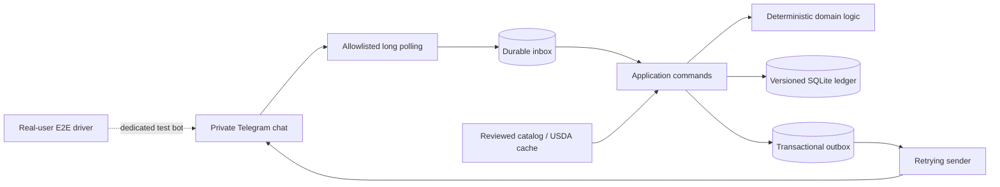

# bite-club

**First rule: log your meals.**  
Second rule: guesses need approval. Third rule: unknown is not zero.

A self-hosted Telegram diary for food, training, and recovery. Built around a deliberately strict contract: every saved quantity has provenance, every correction leaves a revision, and no model gets to invent your nutrition data.

Python 3.13 · aiogram · SQLAlchemy · SQLite · Docker Compose · MIT

## A small app with serious boundaries

Most of the interesting work happens after “150g rice.” What happens when Telegram delivers it twice? When you correct an old receipt? When a portion is a guess? When the worker dies between sending a reply and recording that it was sent?

Bite Club makes those cases part of the design:

| Engineering choice | Where to look |
| --- | --- |
| Durable inbox/outbox, idempotent actions, bounded retries and crash recovery | [Application service](src/nutrition_bot/application/service.py), [worker](src/nutrition_bot/runtime/worker.py), [crash test](tests/test_process_crash.py) |
| Immutable food and meal versions, database-enforced integrity, exact scaled-integer arithmetic | [Meal ledger](src/nutrition_bot/adapters/database/meals.py), [migrations](migrations/versions), [ledger tests](tests/test_meal_ledger.py) |
| Explicit approval of the exact draft revision; stale buttons cannot approve edited estimates | [Draft conversation](src/nutrition_bot/application/draft_conversation.py), [approval tests](tests/test_telegram_drafts.py) |
| Missing data stays visible; reports distinguish recorded amounts from complete intake | [Daily totals](src/nutrition_bot/adapters/database/daily.py), [nutrient screening](src/nutrition_bot/domain/nutrient_gaps.py) |
| Real-user Telegram testing against a separate bot and disposable database | [E2E runner](tools/telegram_e2e), [architecture and trade-offs](docs/telegram-e2e-design.md) |
| A constrained deployment: one process, optional authenticated HTTPS dashboard, non-root container, persistent SQLite | [Dockerfile](Dockerfile), [operations](docs/foundation-operations.md), [deployment runbook](docs/manual-deployment.md) |

The project is in active development. The implementation is substantially ahead of a transport demo; it is also **not the entire planned assistant**. The source is the product of iterative development with AI coding assistance, explicit product decisions, and executable acceptance checks. [Engineering notes](docs/engineering.md) explain the choices and trade-offs.

## Try it without a Telegram account

Install [uv](https://docs.astral.sh/uv/getting-started/installation/), then:

```sh
git clone https://github.com/rserag/bite-club.git
cd bite-club
uv sync --locked --group e2e
uv run python scripts/demo.py
```

The demo exercises the actual application service with **synthetic food values**, simulated Telegram updates and a temporary database. It logs a measured meal, previews a rough portion, approves the displayed estimate, and prints the resulting receipts. It needs no tokens and sends no network requests. Synthetic demo values are not nutrition advice or a starter food database.

## What works today

- **Daily navigation:** a short home menu, topic help, guided catalog/portion entry, recipe creation, label entry, favorite/recent shortcuts and receipt actions; short reports with detail toggles.
- **Optional reminders:** editable timezone, quiet hours, category switches, weight/recovery prompts, training-relative reminders and daily/weekly summaries. All categories start disabled.
- **Optional Mini App:** authenticated mobile dashboard, saved/USDA/barcode food search and review, measured meal forms, recipe portion corrections and recorded-energy charts; requires configured HTTPS ingress.
- **Optional AI drafts:** app-owned ChatGPT plan OAuth or policy-restricted OpenRouter interpretation of meal text/photos; disabled until private setup and evaluation. Every AI proposal needs review before saving.

- **Food diary:** measured meals, preparation-aware current-version search, in-flow USDA discovery/review, optional typed-barcode lookup, reviewed label entry, corrections, delete/undo, food aliases, favorites, repeats and guided batch recipes. Missing-food entry preserves pending meal items and dates; accepted source records work offline.
- **Approval workflow:** persistent rough-portion drafts, version-specific approval, expiry and safe handling of stale buttons or edited messages.
- **Goals and trends:** reviewed calorie/macro targets, weight history, daily/weekly reports and evidence-gated adjustment proposals.
- **Training and recovery:** gym/BJJ sessions and details, plans, recovery check-ins and coverage-aware workload reporting.
- **Training-day allocation:** an explicitly reviewed future week redistributes calories/carbohydrates without changing the weekly budget, protein or fat. Unknown days retain baseline targets.
- **Supplements:** reviewed creatine products, actual intake, phased regimens, dose marks and separate exposure/adherence reports. General nutrient-product entry is not yet available in Telegram.
- **Nutrient review:** versioned adult DRI references, explicit group selection, food/supplement separation, source-specific limits and conservative two-week intake screening.

Next increments include verified-food suggestions, photo label/barcode interpretation, broader historical AI questions, exports and automatic encrypted backups. Planned behavior is documented separately from implemented behavior. AI providers are optional and disabled in the public configuration; live deployment activation is separate.

The [AI user guide](docs/ai-user-guide.md) explains clear meal descriptions, draft review, corrections and manual fallback when AI is enabled.

Operator-run [backup and restore tools](docs/backup-and-restore.md) provide consistent SQLite snapshots, encrypted restic upload/retention, and isolated restore verification. Scheduling and an actual off-site recovery drill remain separate work.

## How it fits together



The worker owns six loops: receive, process, send, cleanup, reminder scheduling and food lookup. Bounded source requests run outside database write transactions, so provider latency does not block diary actions. SQLite runs in WAL mode with foreign keys and full synchronous writes. Network delivery is not exactly-once: a crash after Telegram accepts a reply can produce a repeated reply, while the application action remains idempotent. That boundary is documented and tested.

The app is single-user, not a multi-tenant hosted service. A second account does not get an independent ledger. Telegram remains part of the data path; self-hosting is not end-to-end privacy from Telegram.

## Run your own bot

Create a bot through Telegram's verified BotFather. Copy `.env.example` to `.env` and fill in the token, allowed user ID and private-chat ID locally. Use `APP_TIMEZONE` for the initial IANA timezone. Configure optional USDA/barcode sources using the [food source guide](docs/food-sources.md), or enter a [reviewed label](docs/packaged-foods.md) in Telegram. The [food catalog guide](docs/food-catalog.md) also covers operator imports; the app does not ship a production nutrition database.

```sh
uv run nutrition-bot migrate
uv run nutrition-bot run
```

`nutrition-bot` and `nutrition_bot` remain the CLI/package names. Stop a worker before migrating. Only one worker may use a database at a time. Runtime state belongs on a local filesystem in ignored `runtime-data/`.

For Docker:

```sh
docker compose build
docker compose run --rm bot migrate
docker compose up -d
```

The runtime uses a persistent named volume, read-only root filesystem, dropped capabilities and a 512 MiB memory limit. See [everyday use](docs/everyday-use.md) and the [deployment runbook](docs/manual-deployment.md) for migration, backup and rollback procedures. Automatic encrypted backups remain future work. [Continuous deployment](docs/continuous-deployment.md) builds, verifies and deploys immutable images after production approval.

## Test the rules, not just the happy path

```sh
uv run --group e2e ruff check .
uv run --group e2e ruff format --check .
uv run --group e2e mypy
uv run --group e2e pytest tests tools/telegram_e2e/tests -q
```

The offline suite contains **over 1,300 tests**, including real database migrations, crash/replay cases, exact arithmetic, stale approvals and an offline Telegram double. CI runs offline checks plus a container persistence/migration smoke test. Hosted CI results are available in [Actions](https://github.com/rserag/bite-club/actions); local results are not a substitute for a hosted run.

A separate development runner signs in as a real Telegram test user using Telethon. It talks to a **dedicated test bot**, starts a disposable worker/database per scenario, checks replies and ledger effects, and writes private reports. The ten-scenario regression suite includes restart, corrections, approval, supplements and nutrient coverage. Live tests require deliberate private setup and are excluded from ordinary CI. [Setup and commands](docs/telegram-e2e.md).

Synthetic cases for future model evaluation are in [evals/](evals). They are an evaluation specification, not a claim of model quality or a completed benchmark.

## Read the design

- [Engineering walkthrough](docs/engineering.md) — decisions, trade-offs and verification boundaries.
- [Feature decisions](docs/feature-decisions.md) and [implementation plan](docs/implementation-plan.md) — product scope and acceptance criteria.
- [Technical proposal](docs/technical-proposal.md) — full design, including clearly marked future work.
- [Meal diary](docs/meal-diary.md), [drafts](docs/meal-drafts.md), [recipes](docs/recipes.md), [goals](docs/goals-and-reports.md), [training](docs/training.md).
- [Supplement reports](docs/supplement-reporting.md) and [nutrient review](docs/nutrient-review.md) — reference provenance and uncertainty rules.

Contributions should use synthetic data and preserve the approval and provenance contracts. See [CONTRIBUTING.md](CONTRIBUTING.md) and [SECURITY.md](SECURITY.md). Development tracker data, credentials, personal logs and deployment inventories are intentionally absent from the public repository.

## License

Code is [MIT licensed](LICENSE). External data and services retain their own terms; see [third-party notices](THIRD_PARTY_NOTICES.md). This is a personal tracking tool, not a medical device or a diagnosis engine.
