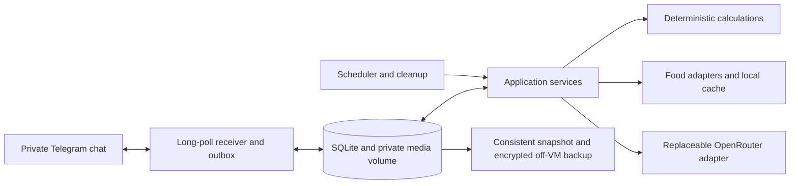

# Implementation plan

This document defines work packages and acceptance criteria, not a live task ledger. Maintainer execution records use local Beads and stay private; public contributors can use GitHub issues. See the README for the current implemented scope.

Current source includes T01–T05, T06.1–T06.5, T06.6.1 nutrient references/review, T06.6.2 reviewed future-week allocation, supplement ledger/plans/reporting, and the separate real-user Telegram test runner. Operator-run encrypted backup/restore and bounded runtime-recovery tools are available. Telegram navigation/guided entry, opt-in settings/scheduling, optional meal AI drafts and authenticated Mini App source are now available. Provider activation and representative live vision evaluation remain separate. Verified-food suggestions, packaged-food workflows, exports and scheduled off-site recovery remain future work. Local tests and selected live scenarios are evidence for those tested paths, not complete production readiness.

## Architecture and boundaries

Use Python 3.13, aiogram 3, SQLAlchemy 2 with aiosqlite, Alembic, Pydantic 2, httpx, and SQLite WAL/FULL. Lock compatible package versions during task T01; the versions here select major families, not an unverified lockfile. One Docker Compose service runs the receiver, inbox processor, outbox sender, scheduler, and cleanup loop. The optional Mini App adds a bounded aiohttp server in the same process behind existing host HTTPS ingress. It uses the same authorized durable inbox and ledger. No FastAPI service, Redis, standalone queue, or new monitoring stack is required.

`domain/` has pure calculations and typed records; `application/` owns transactions, validation, authorization context, and approval rules; `telegram/` translates messages/buttons; `adapters/` handles databases and external services; `runtime/` runs durable work loops. Domain modules must not import Telegram, SQLAlchemy, or an AI SDK. An AI parse is a proposal to application services, never a direct write.

Keep the technical proposal's directory layout. Add `application/settings_service.py`, `application/export_service.py`, `application/erasure_service.py`, `runtime/retention.py`, and `adapters/ai/policy.py` as features arrive. Avoid one class/interface per table; add boundaries where they isolate a real external dependency or calculation.

## Ordered work packages

Each task should produce a runnable increment with the listed checks. T01–T06 form the initial locally usable build; all tasks are required for the confirmed v1. Shipping intermediate increments does not remove later accepted features.

| Task | Depends on | Deliverable | Acceptance checks |
|---|---|---|---|
| T01 Foundation | — | Package/CLI, validated deployment config, uv lock, Ruff/mypy/pytest configuration, container, Compose volume/health check, synthetic fixtures, public-safe examples | Build on a supported target architecture; invalid/missing allowlist fails before polling; offline test mode needs no secrets; non-root container writes only the data directory |
| T02 Durable transport | T01 | Authorized private-chat filter, persisted polling cursor/inbox, serialized domain writer, actions, transactional outbox, supervision, `/status` | Crash before/after commit and replay same update/button: one mutation. Unauthorized message/photo/callback creates no personal record or paid request. Outgoing ambiguous-send duplicates are documented |
| T03 Food ledger | T02 | Nutrient registry, immutable food versions/portions, USDA cache, reviewed manual food entry, meal save/edit/delete/undo, deterministic totals | Cooked/raw distinctions survive; unknown nutrients stay unknown; scaling is stable; updates to food data do not rewrite old logs; cached-food logging works offline |
| T04 Drafts and reuse | T03 | Explicit quantity approval, draft revisions/expiry, aliases, favorites, versioned batch recipes/cooked yield | Every rough portion needs a button approving the displayed revision. Old/duplicate/expired approvals fail safely; uncertain recipes remain flagged; undo restores totals; seven-day inactivity cleanup never commits a meal |
| T05 Goals and reports | T03–T04 | Guided profile, goals/manual targets, weight logs/trends, macro targets, nutrient coverage, full/short daily and weekly reports, conservative weekly proposals | Sparse/incomplete days prevent adjustments; seven-day average distinguishes missing weights; sustained example mismatch yields a bounded proposal; approval changes future targets once; no exercise-calorie add-back |
| T06 Training and recovery | T04–T05 | Quick gym/BJJ logs, optional sets/rounds/RPE, planned vs completed sessions, optional recovery, workload trends, food timing/meal suggestions | Quick log fabricates no actual sets/rounds; inferred effort is labeled; later detail updates one session; missing recovery is unknown; suggestions use supported facts and preserve the agreed weekly calorie budget |
| T07 Settings and scheduler | T02,T05–T06 | `/settings`, conversational changes, recurring schedule/overrides, morning/training/evening/weekly jobs, category switches, quiet hours | Timezone/DST/reboot/settings edits do not replay jobs; historical dates stay stable; cancelled/already-logged sessions suppress prompts; weekly review covers prior completed local week; no AI needed for basic summaries |
| T08 AI and budget | T04–T07 | Replaceable adapter, validated intents/query types, role assignments, approved endpoint manifest, cost reservations, $10 cap and month override | Invalid JSON/unknown tools never mutate data; food numbers never come from model guesses; concurrent/retried calls cannot evade reservations; ambiguous timeouts retain reservations; approved override expires without buying credits |
| T09 Photos and packaged foods | T04,T08 | Meal-photo drafts, reviewed label extraction, typed/photo barcode lookup, OFF adapter with source/license provenance | Blurry/unknown barcode offers fallback; label basis and decimal units reviewed; omitted micros unknown; meal-photo quantities require approval; media limits/path isolation and 30-day cleanup apply |
| T10 Portability and erasure | T03–T09 | Filtered CSV/JSON exports, full deletion scopes/previews, permanent erasure distinct from undo, raw-source cleanup | CSV formula payload neutralized; JSON preserves units/revisions; expired drafts cannot reappear from queues; permanent erasure removes dependent content; restore reconciliation reapplies erasures |
| T11 Operations and CI | T01 onward; complete after T10 | Migration/backup/restore/deploy commands, redacted logs, CI/security/release workflows, runbooks | Fresh + previous-release migrations, disk-full rollback, consistent SQLite backup, verified off-VM restore, health failure/restart, secret scan of image/release contents; release contains no private inputs |
| T12 Production acceptance | All | Reviewed release candidate, endpoint evaluation results, host preflight, private settings setup, real-device Telegram checks, recovery drill | All critical checks below pass; operator can rebuild from repo and restore independently. Only then call it production-ready |

## Implemented first coding increment: T01 and T02 vertical slice

Create the package skeleton and a migration for `profile`, `telegram_inbox`, `telegram_cursor`, `actions`, `outbox`, and runtime heartbeat. Implement `run`, `migrate`, and `healthcheck`; `/start` and `/status` are the first Telegram handlers. A synthetic no-op action exercises authorization, durable intake, one committed action, and an outbox response. Do not add meal schemas without implementing a usable vertical path in T03.

Use one long-poll receiver per deployment. Save the authorized update and next cursor atomically before requesting a higher offset. For unauthorized updates, advance the cursor without persisting content. Process inbox entries through an application transaction that records the action, mutation, and outgoing receipt together. Recover abandoned processing leases after restart. Serialize mutations to reduce SQLite contention; never hold database transactions open across network calls.

The health check reads a local heartbeat/schema status with a bounded age. It must not call a paid provider and should report degraded external APIs separately from a dead worker. A fatal supervised loop failure should stop the process so the container restart policy can recover it; an external API outage should back off while local work continues.

Foundation CI should validate configuration and migrations, run the duplicate/restart/authorization tests, and build the image. T01–T02 are complete only when their smoke checks are executable; README must continue to say which user features are not implemented.

## Schema additions to the detailed proposal

Use Alembic revisions in task order rather than a speculative all-at-once schema. Add these fields/tables when their task lands:

- `drafts.last_user_activity_at`, `expires_at`, `revision`, `status`; expiry and approval compete in the same transaction. Keep source files through explicit references so one expired draft cannot delete another record's valid source.
- `raw_sources` with kind, private path or encrypted payload location, processing timestamp, expiry, and reference links. Inbox/AI payload duplicates must participate in retention; model outputs should generally retain normalized intents only.
- `schedule_rules` with IANA timezone reference, wall-clock time/weekday or session-relative offset, enabled flag, and revision; per-date overrides remain separate. Job identity uses event/category/date/session identity, not just the current UTC due timestamp.
- `ai_budget_periods`, `ai_budget_overrides`, `ai_cost_reservations`, and `ai_attempts`, with integer micro-USD, generation IDs when available, states, and unique attempt IDs. The base is $10; override approval includes month, new total, and expiry.
- `erasure_events` with monotonic sequence, immutable entity UUIDs and cutoff/scope metadata, no erased content. Use UUIDs for erasure-referenced entities so restored databases cannot reuse an erased integer ID for a new record. Export an encrypted append-only deletion manifest off VM; after restoring old data apply the latest manifest before allowing sends. A restored database must not silently claim all deletions are honored if that manifest is unavailable.

Budget-period engineering default: calendar months in the profile timezone at AI activation; persist each period's timezone and UTC boundaries. A timezone edit cannot reset spending or shorten the current period. Construct the next non-overlapping period at rollover; show the actual reset time in `/settings`. Account billing dates can differ and are reported separately. Budget increases only adjust the active period and never refill provider credits.

## Configuration contract

Deployment secrets and immutable auth: `TELEGRAM_BOT_TOKEN`, `ALLOWED_TELEGRAM_USER_ID`, `ALLOWED_TELEGRAM_CHAT_ID`, `DATABASE_URL`, `USDA_API_KEY`, `OPENROUTER_API_KEY`. Prefer one canonical name per secret; replace the proposal's generic `LLM_API_KEY` when scaffolding, with a documented migration alias only if needed.

Model/runtime configuration: `LLM_PROVIDER=disabled|openrouter`, role model IDs, endpoint-manifest path, max attempt count/timeouts, `LLM_MONTHLY_BUDGET_USD=10`, `RAW_INPUT_RETENTION_DAYS=30`, `DRAFT_INACTIVITY_TTL_DAYS=7`. The public template starts with AI disabled and blank secrets. Once configured, the selected deployment uses OpenRouter; disabled examples are not a product decision to remove AI.

Mutable user preferences belong in the database: timezone, units, goals, schedule, quiet hours, reminder switches, report length. Environment values may seed first setup but must not overwrite later Telegram changes on restart. Load private owner preferences deliberately during setup; public defaults contain no personal schedule or server identifiers.

## CI, release, and operation

PR CI runs lint/type checks, offline unit and database integration tests, migrations, and a container smoke check; use mocked Telegram/food/AI APIs. Add dependency, secret, and container vulnerability scans with actionable severity policy and reviewed exceptions. Pin action versions to commit SHAs when authoring workflows and keep the lockfile reproducible. No production secrets in pull-request jobs; do not use a privileged workflow on untrusted PR code.

Build release images in GitHub Actions, publish to GHCR on explicit release, and record the immutable digest. On the VM: verify disk/headroom and backups, pull the digest, pause intake, take a consistent backup, run the explicit migration, start one app instance, and run health and Telegram smoke checks. Do not assume an old image can open a new schema; rollback may require stopping writes and restoring the matching pre-migration backup. Capture newer records before a rollback that would lose them.

Use SQLite's consistent backup API, not copying a live database file without its WAL. Back up any retained media referenced by the snapshot plus a manifest; exclude temporary exports. Encrypt off-site storage using operator credentials unavailable to the application process. Proposed backup rotation remains seven daily/four weekly/six monthly, subject to the actual destination's storage policy. Verify a restore without network sends and reconcile later erasures before enabling the worker.

Use an operator-scheduled host backup job; Docker restarts the bot after reboot. Keep health/status local and logs redacted/rotated. No new Grafana stack is necessary. Document how to detect complete host failure independently; the bot cannot report while the host or Telegram is unreachable.

## Release gates and remaining external inputs

Required evidence: all accepted product flows, measured/estimated quantity distinction, complete correction/undo, duplicate update/action defense, AI-disabled operation, unknown-nutrient coverage, conservative target proposals, history-safe timezone edits, retention/erasure, budget handling, migration and off-VM restore. Live model promotion follows `model-selection.md`; do not report its metrics until measured.

Implementation can start without external accounts. Before live setup, obtain the bot token and allowed IDs through private configuration, a USDA key, a dedicated OpenRouter key/credits, reviewed endpoint policies, an off-site backup destination and encryption secret, and a GitHub repository owner/name/license choice. Do not request credentials in committed files or chat transcripts. Check host capacity before building, testing or deploying significant workloads.

Cloud provisioning, paid services, live reminders and deployment are separate operator decisions. Source publication does not authorize any of them. Confirmed feature scope does not need to be rediscovered when implementing a work package.
