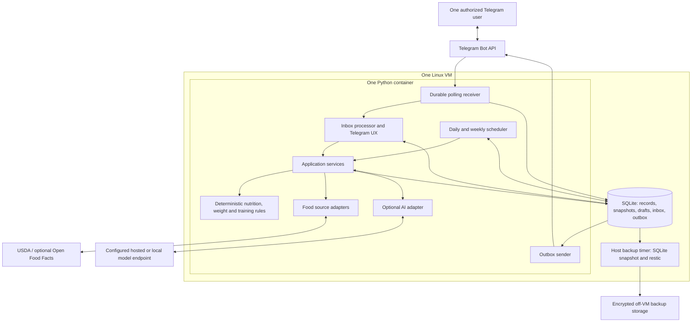

# Bite Club — technical proposal

Status: full-product design specification. The current source implements the food ledger, approvals, goals, weight/training/recovery reporting, supplements and adult nutrient review. Training-day allocation, suggestions, AI, reminders and complete operational automation remain planned. See the README and feature guides for implemented behavior. Reference formulas below are product rules, not individualized prescriptions.

Deployment model: one Linux VM, one isolated Docker Compose service, independent data/secrets, no inbound application port. The runtime has a 512 MiB container limit. Build and run exhaustive tests on appropriately sized development/CI machines; a runtime limit does not constrain build/test resource use. Host inventory and actual deployment records are private.

The 35 confirmed product decisions are recorded in [feature-decisions.md](feature-decisions.md). They define intended scope, not completion status; the current implementation and planned features are distinguished in the README.

Confirmed feature decision: meal text processing is **hybrid**, using local parsing for recognized inputs and a replaceable external AI aggregator for unfamiliar wording. **OpenRouter Standard is selected** as the shared AI platform; exact models remain open; the confirmed privacy policy below governs routing. AI does not supply authoritative nutrition values.

Confirmed AI privacy: **allow reviewed non-training endpoints with disclosed temporary retention**. Apply this to all primary and fallback routes, send only task-relevant context, and keep optional gateway content logging disabled. Record endpoint-specific retention policies and review dates; unknown or incompatible policies are ineligible. If no eligible route is available, offer local/manual operation without silently relaxing privacy.

Confirmed AI budget: **$10 USD per month in model/API usage**, shared across all AI features, retries, and fallback calls. Credit-purchase fees and taxes are separate. At the limit, pause paid AI and offer a Telegram action to explicitly approve a higher limit for the current month. Display the new total limit and expiry before acceptance; restore the base $10 cap next month. Keep local/manual logging, saved meals, and calculated reports available. No automatic top-ups, increases, or credit purchases are authorized.

Confirmed model strategy: **choose models by task**. Use an economical model for routine text, a suitable vision model for meal/label photos, and a stronger model for complex analysis. Application-defined task categories select configurable model assignments through the same OpenRouter integration and shared budget. Exact models require representative evaluation; stronger models still cannot replace deterministic calculations or portion approval.

Confirmed quantity rule: suggestions may use personal history or typical portions, but an uncertain portion stays a draft until the user supplies/confirms a sufficiently precise amount or explicitly taps a Telegram button approving the displayed rough estimate. Prior approvals do not authorize future estimates automatically.

Confirmed photo scope: **keep meal-photo drafts in v1**, governed by the same quantity-approval rule. All AI features share one replaceable aggregator integration, with task-specific text/vision models and a shared spending cap; exact models remain open; the base monthly usage cap is $10 with explicit month-scoped overrides.

Confirmed corrections: **keep full editing, deletion, and undo through conversational replies and Telegram buttons**, including quantity, food, and date changes with recalculated totals. Preserve revisions, clarify ambiguous targets, and require fresh approval for newly introduced rough quantities. Editing an individual log does not implicitly edit its reusable template.

Confirmed meal reuse: **keep both favorites/repeat meals and batch recipes**. Store recipe ingredients and cooked yield or defined servings, calculate consumed portions deterministically, and version templates so edits do not change historical logs. Reused rough portions or uncertain ingredient/yield quantities still require explicit estimate approval.

Confirmed packaged-food scope: **keep barcode lookup and nutrition-label photos**. Accept typed barcode digits or a clear barcode photo; show matched products and provide label/manual fallback when no reliable match exists. Review extracted nutrition values, units, and serving basis; retain provenance and unknown nutrients. Consumed quantity remains a separate input subject to the existing approval rule. Any AI label interpretation uses the shared aggregator.

Confirmed core nutrition tracking: **keep calories, protein, carbohydrates, and fat**, calculated for saved meals and daily totals. Guided targets and adaptive adjustments are confirmed separately below.

Confirmed extended nutrition tracking: **keep fiber and all micronutrients available from reliable food records**, including sodium, potassium, calcium, magnesium, iron, zinc, vitamins D/B12 and other supported nutrients. Show known intake and data-coverage indicators; missing values stay unknown rather than zero. Reporting concerns recorded intake and possible gaps, not clinical deficiency diagnoses.

Confirmed daily UX: **keep the full on-demand daily progress view** through `/today` or natural-language questions, with a compact calories/macros-versus-targets summary, remaining amounts, nutrient overview, and expandable meal/nutrient details. Show comparisons only where targets are configured; target rules and reminder scope follow the confirmed decisions; the selected reminder timing is recorded privately and remains editable.

Confirmed meal suggestions: **keep full on-demand suggestions**, drawing from saved meals/recipes and other verified foods. Offer 2–3 practical options and portions based on configured remaining targets, supported nutrient gaps, and preferences. Calculate nutrition locally from source-backed records. A suggestion is not a consumed meal until explicitly logged, and rough quantities remain subject to the estimate-approval rule.

Confirmed weight scope: **keep full body-weight tracking**, including quick entries, measurement history, seven-day average, and multiweek rate of change with data-sufficiency indicators. Preserve original measurements and avoid reacting to single-day fluctuations. Adaptive calorie-target proposals follow the separately confirmed rule below.

Confirmed initial goal setup: **keep guided goals and suggested starting calorie/macro targets**, including fat loss, maintenance, or lean gain, desired pace, a review/apply step, and manual overrides.

Confirmed adaptive targets: **keep weekly evidence-gated reviews and small explained calorie-target proposals**, applied only after explicit user acceptance. Incomplete evidence or single-day fluctuations must not trigger a change. Delivery timing remains a separate review item.

Confirmed weekly reporting: **keep the full weekly nutrition/weight report and the ability to request a short version**. `/week` provides the full, navigable report; “short weekly report,” `/week short`, or a `Short version` button provides key results and actions. Both use the same calculated facts and retain important completeness caveats and pending adjustment approvals. Offer a `Full report` button to switch back; scheduled delivery is enabled as a configurable feature; the selected times and full-report preference are recorded privately and remain editable.

Confirmed quick gym UX: **keep a simple session log with average-based estimates**, such as “chest and triceps for 40 mins.” Save the reported focus/duration and allow typical effort/load estimates without requiring exercise details. Label estimates and their basis, preferring comparable personally reported history over generic defaults; prior inferred values are not new measured evidence. Leave actual exercises/sets/reps/weights unknown unless provided. Estimated exercise calories and automatic calorie add-back are not authorized by this choice.

Confirmed detailed gym scope: **keep full optional exercise, set, rep, weight, and effort/RPE logging** alongside quick sessions. Accept partial detail without requiring missing fields; distinguish set RPE from session RPE. Attach later details to the selected existing session rather than creating a duplicate workout, and clarify ambiguous sessions or load conventions.

BJJ review decision: **support quick logging from an editable usual-session template**, separating warm-up, non-resisting technical practice, positional work and sparring, with optional reported effort/round details. Store the user's actual routine privately as onboarding context. Typical duration/ranges remain estimates; do not invent actual round counts or precise stage durations, classify the whole session as hard sparring, or double-count round time inside the total duration.

Confirmed training planning: **keep an editable recurring weekly schedule with per-day overrides**. The user's chosen default BJJ weekdays are retained in private onboarding notes, not public source fixtures. Unspecified days remain unknown rather than rest, session times and schedule timezone are stored privately and remain editable, and planned sessions require a completion log/confirmation before appearing in actual training history.

Confirmed training-day nutrition: **keep both planned calorie/carbohydrate allocation and meal/timing guidance around training**, conserving the agreed weekly calorie budget and respecting target feasibility. Do not automatically add estimated exercise calories, rewrite historical targets, or assume unspecified days are rest. Preview material plan changes; unplanned recovery overrides remain explicit and notification timing is recorded privately and remains editable.

Confirmed recovery scope: **keep optional sleep, fatigue, soreness, and readiness check-ins** through conversational text or buttons. Accept partial entries, retain missing values as unknown, and allow corrections. Scheduled prompts remain a separate feature-review decision.

Confirmed workload analysis: **keep workload trends and explained, optional recovery-based training suggestions**, using sufficient personal gym/BJJ history and recovery inputs. Expose incomplete data and inferred effort, handle absent/zero baselines, and avoid claims of injury prediction or diagnosed overtraining. Suggestions do not automatically modify workouts or training plans.

Confirmed historical analysis: **keep natural-language questions about recorded history and AI-written explanations** through the shared aggregator. Application code uses validated predefined query types to select data and calculate authoritative results; AI receives only relevant context. Preserve date ranges, completeness caveats, and the distinction between association and causation. Do not allow generated SQL or treat generated prose as authoritative calculations.

Confirmed notification scope: **keep configurable reminders and summaries**: morning weight/recovery check-ins, relevant training prompts, evening summaries, and weekly reviews. Each category has an independent switch. Suppress already-completed check-ins, respect quiet hours, and avoid sending stale reminder backlogs after restart. The user has supplied reminder times, timezone, training start times, full weekly-report preference, and quiet-hours setting; these are stored privately, never as public defaults. Training prompts are selected for two hours before a planned session and fifteen minutes after its planned end, with editable offsets. Post-session prompts ask for confirmation; planned end times do not establish attendance or actual duration. Suppress cancelled-session and already-logged session prompts. Planned sessions still require an actual completion log; training-relative prompts require a known session time.

Confirmed data export: **keep CSV and structured JSON exports**, available on demand through `/export` or natural language with date/category filters. Include records, units, source references, targets, and relevant revision history, using a versioned JSON schema. Deliver files only to the authorized private Telegram chat after an explicit request; expire temporary server files. Exclude secrets and raw AI/photo payloads by default, and protect CSV text fields against spreadsheet formula injection. Backups remain a separate baseline requirement.

Confirmed local retention: **retain original text and photos on the VM for 30 days after successful processing**. Keep saved structured records and correction history until explicitly deleted. Unconfirmed drafts and their local source copies expire after seven days without user activity; background processing does not extend their lifetime. Expiry never approves a draft or affects saved nutrition totals. Validate expiry again when a user taps an old approval button. Cleanup must cover raw payload copies in inbox and AI/action storage as well as photo files, while retaining structured provenance and approval metadata. This setting does not change Telegram/provider retention or historical backup expiry.

Confirmed deletion scope: **keep full deletion controls** for selected entries, date ranges, categories, or all personal records. Preview scope and affected counts before explicit confirmation of bulk/permanent deletion; distinguish ordinary reversible removal from permanent erasure. Permanent erasure covers related active revisions, raw inputs, derived data, and queued content, while preserving unrelated records and shared reference data. Invalidate stale callbacks and recalculate affected totals. Explain external-copy and backup limitations; require deletion reconciliation after restoring an older backup.

Confirmed settings scope: **allow timezone and all reminder/training configurations to be adjusted through Telegram** using `/settings` or natural language. Persist an IANA timezone and local wall-clock times; show saved settings and next due times. Timezone changes retain the chosen local clock times unless requested otherwise, update future jobs atomically, and preserve historical UTC timestamps/local log dates and the AI usage ledger. Reject ambiguous/invalid times, invalidate stale pending jobs, and avoid replaying delivered notifications. The scheduled weekly report covers the preceding completed local week.

**Recommendation:** one Python application, one SQLite database on local VM storage, one Docker Compose service, Telegram long polling, USDA-backed food records, and an optional replaceable AI adapter. Keep the nutrition ledger and all calculations deterministic.

## 1. Product scope and challenges to the concept

Build a dependable personal diary that answers three questions: **What have I consumed and done? What would help next? Is my plan working over several weeks?**

The strongest product advantage is remembering the user's actual foods, portions, meals, and workouts. A familiar meal should take one message or tap. Reliable corrections matter more than elaborate conversational coaching.

Challenge these assumptions before implementation:

- **More tracked nutrients does not automatically produce better advice.** Many labels omit micronutrients. Unknown is different from zero. A low recorded intake is not evidence of a clinical deficiency. Supplement products, actual doses and optional phased protocols follow the separate reviewed design in [supplements-proposal.md](supplements-proposal.md).
- **Photos do not measure food.** They cannot reliably establish weight, hidden oil, ingredients, or preparation. Treat them as a convenient draft, with reviewed assumptions.
- **Exercise calories are not an entitlement to additional calories.** Initial activity estimates and later weight-based expenditure estimates already include training. Adding every workout's estimated expenditure double counts activity.
- **Weight feedback is slow.** Salt, glycogen, illness, travel, and menstrual-cycle effects can obscure changes. The product must sometimes say “not enough evidence to adjust.”
- **Incomplete logs are not zero intake.** Explicit day-completeness is necessary for useful adaptive targets.
- **Gym and BJJ can compete for recovery, but a diary cannot diagnose overtraining or predict injury.** Offer modest workload options with the reasons visible.
- **One VM can be reliable but is not highly available.** Off-VM backups address data loss; they do not keep the bot online during VM failure.
- **Local ownership is not exclusive privacy.** Telegram sees bot conversations, and enabled AI providers see the selected inputs sent to them.

Goals modify energy balance, macro allocation, meal ranking, and interpretation of weight progress. Micronutrient reference requirements depend primarily on the selected reference population/life stage; they must not fall merely because calories fall. During fat loss, prioritize nutrient density and preserving training performance. During maintenance, favor stable trends and recovery. During gain, use a modest surplus and monitor whether the intended rate is being exceeded.

Success criteria: known-food logging usually needs no clarification; unfamiliar meals need at most one or two focused questions; corrections take one reply; daily summaries show at most two actionable observations; every numeric recommendation has a reproducible explanation.

## 2. Essential MVP features

The MVP is a useful deployed vertical slice, with production reliability included from the beginning:

- One allowed Telegram user, private chat only; short onboarding for timezone, units, profile, goal, food preferences, training schedule, and AI consent.
- Text food logging, verified food search, edible-gram conversion, visible quantity assumptions, recent foods, favorite meals, and reusable recipes.
- Edit, delete, undo, backdated entries, and persistent unfinished drafts.
- Calories; protein/carbohydrate/fat; fiber; sodium, potassium, calcium, magnesium, iron, zinc, vitamin D, B12. Extensible nutrient registry for vitamins A/C/E/K, folate, other B vitamins, selenium, iodine, and others when available.
- Daily totals/remaining targets, weekly averages, coverage indicators, and an explicit “All food logged” action.
- Weight logging, seven-day averages, robust multiweek trend, and explained calorie-adjustment proposals requiring acceptance.
- Gym session summaries and optional exercises/sets/reps/load/RPE; BJJ duration/intensity/optional rounds; explicit rest days; simple recovery check-ins.
- Rest/gym/BJJ/double-session planning; practical carbohydrate timing and recovery suggestions.
- Deterministic food/meal suggestions from accepted local foods/templates.
- Optional structured text interpretation through an AI provider; a usable AI-disabled path.
- Export, automated backups, tested restore, migrations, health checks, redacted logs, and CI.

Photo-assisted logging is confirmed for v1. Implement it after the text ledger is trustworthy; early internal MVP deployments may precede it, but the agreed v1 includes reviewed meal-photo drafts. Retain a user setting to disable photo processing.

## 3. Features to postpone

Postpone autonomous diet changes, full training-program generation, injury prediction, autonomous supplement selection or therapeutic dosing, clinical deficiency claims, wearable integrations, a dedicated live-camera scanning interface, voice transcription, restaurant-menu scraping, broad pantry/inventory management, a web dashboard, social features, multiple users, vector search, an agent framework, and self-hosted model inference. User-reviewed supplement labels, actual-dose logging and optional phased plans are now included as specified in [supplements-proposal.md](supplements-proposal.md). Barcode decoding from an ordinary Telegram photo is included in the confirmed packaged-food feature.

Barcode lookup and reviewed label-photo entry are included in v1. A full commercial food catalogue, complex recipe optimization solver, and body-composition inference are postponed.

## 4. Recommended architecture

Use a small modular monolith. Telegram handlers translate inputs into application commands; application services coordinate work; pure domain functions calculate results; adapters access Telegram, SQLite, food providers, and AI. Dependencies point toward the domain.

Run four bounded async loops in one supervised process:

1. **Receiver:** fetch Telegram updates and persist accepted inputs before acknowledging receipt to Telegram.
2. **Processor:** interpret persisted work, resolve foods, maintain drafts, and commit idempotent domain actions.
3. **Sender:** deliver committed outbox messages with retry/backoff.
4. **Scheduler:** materialize due summaries/reviews with persistent unique job keys.

These are tasks within one process, not separately deployed workers. Use short database transactions; never keep a transaction open while calling an external service. A slow AI request must not block polling or fast commands such as `/today`. Park slow work in a persisted waiting state; allow a bounded number of provider tasks while serializing domain mutations. Record work ownership/lease expiry. After taking the exclusive process lock at startup, reclaim interrupted processing jobs and expired provider waits; retry them through the same idempotent application commands. An inbox row must not remain stuck simply because its previous process died.

**Durable receipt contract:** call `getUpdates` using the stored cursor; authenticate each update; transactionally insert accepted updates and advance the cursor to the highest returned update ID plus one; only then poll using that new cursor. Rejected updates advance the cursor but their contents are not retained. Dispatch from the persisted inbox, not directly from an in-memory framework queue.

Telegram acknowledges an update when a later request uses an offset beyond its ID, and retains pending updates for at most 24 hours. Long polling therefore cannot recover messages never received during an arbitrarily long outage. The bot says “Saved” only after a domain commit. [Telegram Bot API](https://core.telegram.org/bots/api#getupdates)

Processing commits the domain mutation, completed-action key, inbox status, and outgoing response together. Unique keys prevent duplicate meals after replay or repeated button clicks. Outgoing Telegram messages are **at least once**: a crash after sending but before recording success can produce a duplicate receipt. Do not promise exactly-once delivery.

Use one filesystem process lock on the data volume to prohibit duplicate instances. Explicitly handle Telegram's conflicting-poller error. Deployments must stop the previous poller before starting its replacement.

## 5. Architecture diagram



The VM needs outbound HTTPS. No public application port, domain name, reverse proxy, or TLS certificate is required for long polling. SSH remains the administration interface.

## 6. Technology choices and alternatives

| Decision | Realistic alternatives | v1 choice and reason |
|---|---|---|
| Language | Python; TypeScript/Node | Python 3.13, latest patched release in that line at implementation. Good data/validation/testing ecosystem; little operational machinery. |
| Telegram SDK | aiogram; python-telegram-bot; raw Bot API calls | aiogram 3 for typed Telegram objects, routers, and middleware. PTB is equally credible if the implementer knows it better. Raw HTTP creates unnecessary API-maintenance work. |
| Transport | Long polling; HTTPS webhook | Long polling: simplest VM deployment. A webhook is justified only by future ingress requirements, not by one user's volume. |
| Persistence | SQLite; PostgreSQL; JSON files | SQLite. Structured transactions and constraints without a database service. PostgreSQL becomes worthwhile for multiple independent writers, remote DB access, or several app instances. JSON files are unsuitable for reliable linked edits. |
| Database access | SQLAlchemy/Alembic; plain sqlite3/versioned SQL | SQLAlchemy 2 + aiosqlite + Alembic. The small dependency cost buys clear models and disciplined migrations. No generic repository framework. |
| Scheduling | Small asyncio loop + SQL job keys; APScheduler; Celery/Redis | Small loop for a handful of daily/weekly tasks. APScheduler becomes useful for substantially richer calendars. Celery/Redis is unnecessary here. |
| Service layer | Bot application; FastAPI + bot; separate services | Bot application only. Add FastAPI when a real HTTP consumer exists. A CLI provides health/admin functions. |
| Deployment | Docker Compose; systemd + virtualenv | One-service Compose for reproducible images and portable operations. systemd + virtualenv is viable if Docker is unwanted. |
| Monitoring | Logs + health CLI; hosted dead-man heartbeat; Prometheus/Grafana | Logs + health CLI, with optional external heartbeat. A dashboard stack costs more maintenance than this app needs. |
| AI | Hosted API; local inference; no AI | Optional hosted structured-output adapter; disabled mode fully supported. Local endpoint support later without running inference on the small VM by default. |

SQLite explicitly suits application-owned data on the same machine. Use local disk, WAL, `foreign_keys=ON`, `busy_timeout=5000`, and `synchronous=FULL`; serialize writes and keep them short. WAL still permits only one concurrent writer. [SQLite deployment guidance](https://www.sqlite.org/whentouse.html), [WAL](https://www.sqlite.org/wal.html)

aiogram's default polling can run handlers as independent tasks. Use its client and dispatcher with the durable receiver described above; do not assume SDK polling provides persistent work. [aiogram dispatcher implementation](https://docs.aiogram.dev/en/latest/_modules/aiogram/dispatcher/dispatcher.html)

Use Pydantic 2 for boundary validation, pydantic-settings for configuration, httpx for provider HTTP, uv with a committed lockfile, pytest, Ruff, mypy, and a small optional matplotlib chart renderer. Pin exact resolved versions in the lockfile and container digest after CI verification.

## 7. Telegram UX

Natural language is the main interface. Provide three optional persistent shortcuts: **Today · Log · Recent**. Use inline buttons for choices and corrections. Avoid long menus and mandatory wizards after onboarding.

| Command | Purpose |
|---|---|
| `/today` | Energy/macros, training plan, remaining targets, two useful observations |
| `/week`, `/week short` | Full weekly report or short version; dated intake, complete-day averages, weight trend, adjustment proposal; add training load if selected |
| `/weight 79.4` | Save measurement and show trend; omit number for prompt |
| `/meal` | Favorites, recent meals, food search, new recipe |
| `/gym` | Log session, repeat a workout, optionally enter sets |
| `/bjj` | Duration + intensity; optional rounds |
| `/goal` | Fat loss/maintenance/gain, desired rate, preview and apply |
| `/settings` | Units, timezone, reference profile, reminders, food preferences, AI privacy |
| `/undo`, `/cancel` | Reverse a clearly identified latest action; cancel a pending draft |
| `/export`, `/status`, `/sources` | Portable records; service status; nutrition provenance |

**Three paths:** known food/template with an explicit precise quantity or an explicitly selected fixed measured portion saves immediately with `Edit · Undo · Save meal`; ambiguous entries ask a focused question to establish the amount; any remaining rough quantities, including average portions and photo estimates, require an explicit `Approve estimate` Telegram button tap before saving. Past approval of an uncertain portion does not authorize its reuse automatically.

The bot can propose quantities based on personal history or standard averages. Show the suggested quantity, its basis, and preparation assumptions, with `Enter amount · Approve estimate · Cancel`. Estimates expressed in grams remain estimates. One approval can cover an itemized meal draft, but must reference that exact draft revision; changing its quantities invalidates the approval. Persist the approving action/time and quantity provenance. Estimated entries remain labeled as such after approval and are not treated as measured portions by analytics. No response or high model confidence substitutes for the required tap.

A saved receipt identifies the meal, date, quantities, preparation assumptions, approximate energy/macros, and short entry ID. Show rounded values rather than false precision. Exact stored arithmetic can retain more precision.

Corrections can be a reply: “rice was 120 g,” “move this to yesterday,” or “delete the banana.” A reply to a receipt resolves the affected entry. If several entries could match, show choices rather than guessing. Editing an original Telegram message creates a proposed replacement of its existing linked meal; it must not append a second meal. Deleting a Telegram message is not the diary-delete operation.

Soft deletion removes an entry from totals immediately and supports undo. Maintain revision/audit records locally. Inline buttons contain opaque IDs and expected versions; recheck user, chat, ownership, expiry, and current revision before applying. Old buttons fail safely and show the current entry. Pending drafts survive restarts and never contribute to totals.

Onboarding asks only what calculations need: timezone/units, weight, age, height, selected reference category or manual calorie target, usual non-exercise activity, planned weekly training, goal/rate, diet restrictions/allergies, and optional reminders/AI. Allow skipping estimates by setting a manual target. Do not infer health status, sex-specific reference requirements, or personal measurements from chat context.

## 8. Nutrition-data strategy

| Source | Strength | Limitation | Decision |
|---|---|---|---|
| USDA FoodData Central | Generic foods, food-specific portions, broad nutrients; CC0 data | Matching, preparation state, and nutrient normalization need care | Primary source |
| Open Food Facts | Packaged foods and barcode lookup | Community/label data; many missing micros; separate licensing obligations | Proposed provider for confirmed barcode feature |
| Edamam | Convenient integrated natural-language nutrition analysis | Published caching/storage restrictions conflict with independent historical ownership | Do not use for v1 |
| Local selected-food cache | Fast, works during outages, stabilizes history | Requires provenance and versioning | Mandatory |

USDA's API guide documents access and public-domain data terms. Its datasets differ; prefer Foundation/FNDDS/SR-style generic records where suitable, and exact branded records when the user supplies a label or barcode. Edamam's published plans impose substantial caching restrictions. [USDA API guide](https://fdc.nal.usda.gov/api-guide/), [dataset documentation](https://fdc.nal.usda.gov/data-documentation/), [Edamam terms/plans](https://developer.edamam.com/edamam-nutrition-api)

Keep Open Food Facts optional, with attribution, source license metadata, identifying User-Agent, and configurable rate limiting. The catalogue/database, contents, and images have different licensing terms. Do not bundle downloaded or combined catalogues in the public repository. [OFF API](https://openfoodfacts.github.io/openfoodfacts-server/api/), [OFF licensing](https://openfoodfacts.github.io/openfoodfacts-server/api/tutorials/license-be-on-the-legal-side/)

**Resolution pipeline:**

1. Parse food description, quantity, unit, preparation, brand, meal label, and date.
2. Resolve confirmed personal aliases and recipe names, then cached candidates, then remote search.
3. Rank candidates by preparation, exact brand/barcode, name, and portion compatibility. Ask about material ambiguity; self-reported model confidence is insufficient.
4. Convert to edible grams using explicit mass or a portion defined for that exact food version. Millilitres require a known density. “One banana” needs a visible size assumption.
5. Calculate `amount = edible_grams × amount_per_100g / 100`.
6. Store selected food version, grams, assumptions, quantity method, source reference, and calculated nutrient snapshot.

Raw and cooked foods are separate records. Never use a universal cooked/raw multiplier. Ask about oil/dressing when material. A recipe stores ingredient snapshots and the actual total cooked yield; a portion is a fraction of that yield. Recipes and meal templates are versioned so later edits do not alter past meals.

Maintain canonical units: kcal; g for macros/fiber; mg for major minerals; µg for vitamin D/B12 and appropriate trace nutrients. Preserve nutrient definitions such as folate DFE and vitamin A RAE. Sodium is distinct from salt. Avoid equating total carbohydrate definitions across jurisdictions without metadata.

Use provider-reported energy with a documented energy-field priority. USDA can expose different energy nutrient IDs, including 2047/2048; an adapter cannot rely only on 1008. `4P+4C+9F` is a plausibility check, not a replacement for a valid source energy value, because fiber, alcohol, rounding, and energy factors differ. [USDA Foundation food documentation](https://fdc.nal.usda.gov/Foundation_Foods_Documentation/)

Missing nutrient rows mean **unknown**. A measured zero is an explicit zero with provenance. Do not silently fill branded-food micros from generic foods. An optional reviewed substitution must remain tagged as imputed and excluded from high-confidence coverage claims.

Cache selected records indefinitely for historical reproducibility; refresh by creating new versions. Keep source payloads only where terms permit. Search-result caches can expire. Seed a small reviewed starter catalogue of common foods with provenance, not invented values; expand through use. During outages, use cached foods, templates, or user-entered label values; unresolved foods remain drafts.

## 9. AI/LLM integration

| Deterministic | AI may help | Never depend only on AI |
|---|---|---|
| Authentication, dates, units, food matching rules, sums, targets, trends, data coverage, workload flags, writes | Free-text intent parsing, food/exercise descriptions, photo drafts, wording summaries, explaining computed patterns | Authoritative nutrient values, energy arithmetic, actual weight trend, target application, medication/supplement advice, record identity, authorization |

Define a small `AIInterpreter` interface: `parse_text(input, bounded_context) -> Intent` and `parse_photo(image, caption) -> MealDraft` (disabled when photo processing is off). Define `SummaryWriter` separately so interpretation can work without generated coaching. Route all three capabilities through the same configured aggregator integration, using task-appropriate models rather than requiring one model for every task.

Intent types include `LogMeal`, `LogWeight`, `LogGym`, `LogBJJ`, `LogRecovery`, `EditEntry`, `ShowToday`, `ShowWeek`, `SuggestMeal`, and `ProposeGoalChange`. Food-intent fields include name, quantity, unit, preparation, brand, and assumptions—no authoritative nutrition totals. Validate all output with Pydantic, bounded ranges, allowed units, and enum values.

Start with `DisabledAdapter` and one configurable aggregator-compatible Chat Completions adapter targeting the selected OpenRouter platform. Keep the adapter replaceable. “OpenAI-compatible” does not guarantee identical vision, JSON Schema, tool, or error support. Keep a capability matrix and common adapter contract tests. Require the local parser to account for the entire meaningful input before bypassing AI; unrecognized modifiers must not be silently ignored.

For OpenRouter, structured-output capability is endpoint-specific. Require supported parameters and validate results locally; constrain fallback routing to approved providers with the same privacy and cost requirements. Exact models remain to be selected within the confirmed non-training policy, which permits reviewed temporary retention. [OpenRouter structured outputs](https://openrouter.ai/docs/guides/features/structured-outputs), [provider routing](https://openrouter.ai/docs/guides/routing/provider-selection)

Structured output improves schema adherence but can still contain factual mistakes. Handle refusal, incomplete output, invalid values, timeout, and unsupported capabilities explicitly. [Official OpenAI structured-output documentation](https://developers.openai.com/api/docs/guides/structured-outputs)

Historical questions map to approved query intents with validated date ranges, such as `weekly_intake` or `weight_trend`. Application code executes predefined parameterized queries. Never let a model generate arbitrary SQL or execute commands. Meal recommendations choose existing food IDs and allowed portions, then recalculate/rank locally; model wording cannot override those numbers.

The domain produces `AdviceCard(rule_id, facts, suggestion, limitations)` objects. Render these deterministically by default. Optional AI rewriting receives only relevant facts; attach the authoritative numbers through a fixed template so a prose model cannot change them.

Set bounded request timeouts, a maximum number of concurrent calls, limited retries for transient errors, and a monthly budget ledger. Reserve estimated cost before calls to enforce a cap. Provider/model pricing is configuration, not a permanent hardcoded assumption. Cache interpretation of reusable user-confirmed aliases rather than replaying full chat histories. Common commands and templates make no AI call.

With AI unavailable: weight/training short forms, commands, food search, templates, edits, totals, calculations, and scheduled reports still work. Free-form requests can offer a manual draft. The bot must not report an unparsed meal as saved.

Cloud AI receives the minimum selected text/facts. Images are sent only after the user enables photo processing; local image files are retained for 30 days after successful processing; unconfirmed drafts instead expire after seven days without user activity, with their source copies removed under the shared-reference cleanup rules. Prefer stateless requests and `store=false` where supported, but do not equate that option with zero provider retention. [Official OpenAI data controls](https://developers.openai.com/api/docs/guides/your-data)

## 10. Database and data ownership

Use integer primary keys, named constraints, foreign keys, UTC timestamps, and explicit local calendar dates plus IANA timezone at the time of logging. Store original units and normalized units. Use Decimal arithmetic and fixed-scale INTEGER persistence: nutrient quantities are millionths of their canonical unit, and food/body/exercise mass uses integer milligrams/grams as explicitly named by each field. Do not rely on SQLite NUMERIC affinity or binary floats for exact round trips. Quantize once at the storage boundary and round more coarsely for presentation. Keep validation/calculation versions so results can be reproduced.

`profile` has one row enforced by `id=1`; the allowed Telegram ID remains deployment configuration. All domain data belongs to that singleton—no tenant architecture.

| Table(s) | Principal fields and constraints |
|---|---|
| `profile` | `id=1`, timezone, units, height, age/reference information, dietary preferences, restrictions, notification settings, AI consent, optional reference weight |
| `goals` | mode, signed target kg/week, start/end dates, requested rate, provenance; at most one active goal |
| `body_measurements` | measured_at, local_date, type (weight/waist), normalized value/unit, context, revision, deleted_at; preserve repeats |
| `nutrients` | canonical code, name, unit, definition; stable registry |
| `foods` | canonical name, brand, barcode, preparation, aliases, source family |
| `food_versions` | food FK, provider ID, fetched_at, source URL/license, basis grams, immutable version/hash |
| `food_nutrients` | food-version FK + nutrient FK unique, per-100g amount, quality/provenance; absent/NULL unknown, explicit zero known |
| `food_portions` | food-version FK, label, edible grams, original measure, density/assumption source |
| `meal_templates`, `template_versions`, `template_items` | name, immutable version, ingredient food versions/grams, cooked yield, serving definition |
| `meals` | consumed_at, local_date, label, source message, revision, template-version FK, deleted_at |
| `food_log_entries`, `entry_revisions` | stable entry/meal identity and active revision FK; revision rows contain food-version FK, edible mass, original quantity/unit, quantity method, estimate basis, approving action/time if estimated, assumptions, deleted marker; unique entry/revision number |
| `entry_nutrients` | entry-revision FK + nutrient FK unique, scaled amount, source quality/origin; immutable snapshot for each entry revision |
| `daily_checkins` | local_date unique, food_complete, training_complete, explicit rest, notes; incomplete/missing distinct from zero |
| `target_plans` | effective dates, goal FK, TDEE estimate/basis, average kcal, protein/fat rules, calculation version |
| `daily_targets` | local_date + revision unique, plan FK, day type, kcal, protein_g, fat_g, carbs_g, allocation reason; active revision marker |
| `nutrient_targets` | reference profile/version, nutrient, target value/unit, kind (RDA/AI/limit/UL), applicability (food/supplement/total), effective dates |
| `target_proposals` | evidence window, old/new values, slope, evidence metrics, reason codes, algorithm version, pending/accepted/rejected, accepted_at |
| `exercises` | name, aliases, movement/muscle tags, load convention (per hand/total/bodyweight) |
| `training_plan` | local_date, planned gym/BJJ/rest sessions, expected intensity; never equivalent to completion |
| `training_sessions` | actual start, local_date, kind, duration, session RPE, reported/inferred RPE source, notes, revision, deleted_at |
| `workout_sets` | session/exercise FKs, set index, reps, load_kg, set RPE, warmup/working flag; unique session/exercise occurrence/set |
| `bjj_details` | session FK unique, intensity label, rounds, minutes per round, optional drilling/rolling split |
| `recovery_metrics` | local_date, sleep hours, soreness 1–5, fatigue 1–5, readiness 1–5, optional resting HR/context |
| `drafts`, `actions` | typed validated payload, state, expiry, expected revision, applied entity IDs, idempotency key unique |
| `ai_runs` | purpose, provider/model, schema/prompt version, latency, usage/cost, status, linked action; no full transcript by default |
| `audit_events` | entity, revision, operation, previous/new structured values or revision IDs, source action, timestamp |
| `telegram_inbox`, `telegram_cursor` | update_id unique, permitted payload, status, retry time, attempts; next offset singleton |
| `outbox`, `scheduled_jobs` | unique logical message/job key, payload, status, next attempt, Telegram message ID, due date |

A `daily_nutrition_summary` SQL view aggregates active confirmed entry snapshots. Weekly totals/averages, rolling weight averages, trends, adherence, and training load are calculated on demand. Do not create a second authoritative daily-total table. A future cache must be disposable and revision keyed.

Permanently retain structured logs, accepted source snapshots, active/history target plans, accepted/rejected proposals, and correction history until the owner deletes them. Retain raw source text/photos for 30 days after successful processing; preserve minimal deduplication/action metadata. Full AI transcripts are not retained by default. Unconfirmed drafts and their local source copies expire after seven days without user activity. Full conversational memory is unnecessary.

Changing a food record/template never rewrites old meals. Correcting a meal creates a new revision, updates current totals, and makes old reports auditable. Targets already used for past dates remain historically stable; accepted adjustments take effect in the future. Timezone changes affect future scheduling; moving old entries between days is explicit.

## 11. Core calculations and algorithms

All numeric defaults in this section are configurable product heuristics. Reference equations inform initialization; observed logs inform later review. Persist evidence and reason codes for every proposal.

### Initial TDEE and goal target

Prefer a manually entered known maintenance intake if supported by stable weight and complete logs. Otherwise offer a provisional Mifflin–St Jeor estimate:

```text
RMR = 10 × weight_kg + 6.25 × height_cm − 5 × age_years + coefficient
coefficient = +5 or −161 for the equation's supported reference categories
initial_TDEE = RMR × selected total-activity factor
```

Explain the equation's limitations, allow manual override, and never infer the coefficient. Offer broad activity choices (for example 1.4, 1.6, 1.8), explicitly including usual training. Present a rounded provisional estimate, not a measured metabolism. The original equation is a population estimate. [Mifflin et al.](https://pubmed.ncbi.nlm.nih.gov/2305711/)

Represent gain as positive and loss as negative:

```text
initial_energy_delta = 7700 × target_kg_per_week / 7
initial_calorie_target = initial_TDEE + initial_energy_delta
```

Use 7,700 kcal/kg only as a rough short-window controller conversion, never as an exact long-term body-weight forecast. Energy-balance physiology changes over time. [NIDDK Body Weight Planner](https://www.niddk.nih.gov/health-information/weight-management/body-weight-planner)

Suggested starting ranges: loss about 0.25–0.5% of body weight/week; maintenance near zero; gain about 0.1–0.25%/week. These are adjustable conservative defaults for this product. Bound initial loss to roughly 20% below provisional TDEE and gain to roughly 10% above; if the requested rate conflicts, preview the conflict rather than silently accepting an aggressive target. Persist the resulting reviewed calorie range in the target plan. Revalidate every adaptive proposal, accepted override, and daily allocation against that range and macro feasibility. Repeated capped reductions cannot silently bypass it; reaching a bound requires a fresh plan review. There is no universal safe calorie floor inferred from weight alone. Incompatible targets or clinical/life-stage needs use manually reviewed targets.

### Weight smoothing and control eligibility

- Keep all measurements. For trend calculations, choose an explicitly marked morning measurement; otherwise use that date's median. Retain outliers and ask about suspected mistakes rather than deleting evidence.
- Display the arithmetic mean over the last seven calendar days when at least four dates have measurements, alongside the number of measurements. Missing dates are not interpolated.
- For adjustment decisions, use Theil–Sen: median of `(weight_j − weight_i)/(day_j − day_i)` across valid pairs at least seven days apart, multiplied by seven. Use actual elapsed dates over the most recent 21–28 days in the current stable target/goal regime.
- Require at least 21 days since the latest accepted target/goal change, at least 12 measured dates, at least three dates in each complete seven-day block counted backward from review, and no measurement gap longer than seven days.
- Require at least 90% explicitly complete food days, no unresolved energy-bearing meals on those days, no known systematically missing high-intake days, and mean complete-day intake within about 10% of the mean targets for the same dates. These are product gates, not proof that self-reported data are accurate.
- Pause automated proposals around flagged illness, travel, major training changes, or marked fluid-related changes. Record the reason; allow manual review. Never interpret a single heavy morning as fat gain.

### Adaptive target adjustment

Review weekly. Use a configurable deadband of `max(0.10 kg/week, 25% of abs(target_rate))`. Require a mismatch outside the deadband in the same direction on two consecutive eligible weekly reviews.

```text
raw_delta = (target_rate − observed_rate) × 7700 / 7
proposal_delta = round_to_50(clamp(0.5 × raw_delta, −150, +150))
```

Example: desired `−0.4 kg/week`, observed `−0.1`: raw correction is about `−330 kcal/day`; damping/capping yields a proposal of `−150 kcal/day`. Show the observation window, food completeness, average intake, and reasons. The user chooses `Apply · Keep target · Review logs`. Accepted changes take effect tomorrow; another adjustment waits for a new stable window.

If intake is consistently above the existing plan, discuss adherence/logging first instead of automatically lowering the plan. If weight changes faster than intended, the same signed formula increases calories for overly rapid loss or reduces a surplus for overly rapid gain.

Estimate effective expenditure as:

```text
observed_effective_TDEE = mean_complete_day_intake − 7700 × weight_slope_kg_per_day
```

Mark it provisional unless coverage is strong; missing days can bias it. Smooth successive eligible estimates (for example 75% previous, 25% new) and round to 50 kcal. It represents an intake/weight-based estimate, including logging error and activity, not laboratory metabolism. **Do not also recompute the target from this TDEE after applying the feedback delta**; that would apply the same correction twice. v1 uses the feedback controller to modify targets and the expenditure estimate for explanation.

### Macros and training-day allocation

Use a stable reference weight, defaulting to the current multiweek weight estimate. Allow a reviewed alternative when actual body weight is not an appropriate basis.

- Protein default: approximately 2.0 g/kg/day in fat loss; 1.8 g/kg/day at maintenance/gain. Keep it stable across rest and training days, refreshing the reference weight at plan reviews rather than on every weigh-in. These are adjustable sports-nutrition starting points. [ISSN protein position stand](https://jissn.biomedcentral.com/articles/10.1186/s12970-017-0177-8)
- Fat default: approximately 0.8 g/kg/day, normally within a configured 20–35% energy range. If constraints conflict, flag the plan; do not create negative carbs or force implausible fat intake.
- Carbohydrate: remaining energy, `carbs_g = (kcal − 4×protein_g − 9×fat_g)/4`.
- Fiber uses the selected age/reference target; an optional energy-based planning guide is around 14 g/1,000 kcal, with source and tolerability notes. Do not silently replace the selected age/reference target with a lower number during a calorie deficit. [Dietary Reference Intakes macronutrient tables](https://www.canada.ca/en/health-canada/services/food-nutrition/healthy-eating/dietary-reference-intakes/tables/reference-values-macronutrients.html)

Illustration only: 80 kg, 2,400 kcal, protein 160 g, fat 64 g gives approximately 296 g carbohydrate. Display 295–300 g rather than implying a biological need for exactly 296 g.

Preserve the weekly calorie budget. Assign plan scores rest=0, gym=1, BJJ=2, double=3; a hard session can add one, capped at four. Start with `shift_d = 100 × (score_d − mean_week_score)` kcal. Scale all shifts together if any exceeds ±200 so their sum stays zero; round and reconcile the residual deterministically. Keep protein/fat stable and distribute shifts through carbohydrate. This is an optional scheduling heuristic, not a calorie-burn estimate.

Changes to the remaining week never rewrite past targets. Conserve the remaining planned budget when feasible; if redistribution breaches configured limits, present an explicit proposed budget change instead of hiding it. Extra recovery food after an unplanned hard session is a visible one-day override, not an automatic repeated bonus or punitive restriction the next day.

### Weekly nutrition and micronutrient review

Show seven dates with complete/incomplete/unknown status. Averages divide by complete days, never by seven with blank days treated as zero. Show the denominator and exclude incomplete days from adaptation. Calculate calorie deviation and macro adherence against each day's historical target. Do not turn adherence into a moral score.

Micronutrient reporting has two distinct questions: **How much is known? How complete is the source data?** Show known intake plus foods with unknown values; do not rely solely on calorie-weighted coverage because water, salt, and low-energy foods may matter. Track observed vs imputed contributions separately.

Use a versioned reference set (initially US adult DRIs, explicitly selected during onboarding; add EFSA later). Preserve RDA/AI/limit/UL distinctions and food-versus-supplement applicability. The magnesium supplemental upper limit, for example, must not be applied blindly to food magnesium. [NIH reference overview](https://ods.od.nih.gov/HealthInformation/nutrientrecommendations/), [NIH magnesium guidance](https://ods.od.nih.gov/factsheets/Magnesium-HealthProfessional/)

Offer a “possible intake gap” only after at least five complete days in each review week, known non-imputed values for at least 90% of consumed entries for that nutrient, and repeated below-reference intake. If an unknown food could be a material source, show “coverage uncertain” instead; the entry-count threshold is a disclosed data-quality heuristic. An illustrative trigger is below 80% of the reference across two eligible weeks; label this as a product reminder, not a deficiency threshold. For Adequate Intake (AI) reference values, below-reference intake does not establish inadequacy. Sodium is a limit/caution, not a gap the user should fill. Do not automatically recommend supplements or infer blood nutrient status.

### Remaining-day meal recommendations

Compute remaining energy/protein and relevant known gaps, respecting incomplete logs. Filter accepted foods/templates by allergies/preferences first. Enumerate sensible portion sizes (for example 0.5×, 1×, 1.5×), calculate each locally, and rank lexicographically: practical energy fit, protein need, training suitability, supported nutrient gaps, user preference. Show two or three options with the portion and calculated contribution. No solver or LLM-generated nutrient values are needed. If already above target, suggest a normal balanced option if hungry; do not prescribe compensatory fasting.

## 12. Gym and BJJ integration

Session summaries are valid data. “Chest and triceps for 40 mins” saves the reported focus/duration without requiring exercises or sets. Missing effort can use a clearly labeled typical estimate from comparable reported history or a visible configurable default, with its source retained and an edit option. Do not populate unreported exercises, sets, reps, or weights from averages. The confirmed optional detailed logging adds exercise aliases, set order, reps, load convention, set RPE, and warmup flags; details added later belong to the existing session. “Repeat last session” copies a draft for editing, not a claim that a workout occurred.

Estimate **training load**, not calories, with `duration_minutes × session_RPE_0_to_10`. A 75-minute BJJ session with reported RPE 6 is 450 arbitrary units. Medium intensity may map to an initial RPE 5, but store it as inferred and let the user correct it. Session RPE is distinct from the RPE of one lifting set. [Original session-RPE study](https://pubmed.ncbi.nlm.nih.gov/11708692/)

Track total and modality-specific weekly load. Compare the latest complete week with the median of the preceding four valid weeks; require at least three reference weeks with confirmed training/rest coverage. Missing training days are unknown. A ≥30% increase is a configurable prompt to review recovery, not an injury-risk threshold. If baseline load is zero or too sparse, show “starting/resuming training; no relative baseline” instead of dividing by zero or reporting an infinite increase.

Gym-specific signals include working sets per exercise/muscle tag, repeated-session reps/load, and whether effort is rising at the same workload. Tonnage is meaningful mainly within comparable exercises; do not equate a squat kilogram with a curl kilogram or BJJ load.

Practical rules:

- Before a hard BJJ session, if recent carbohydrate intake is low and a meal is several hours away, offer a familiar carbohydrate snack or move planned carbs earlier. A 25–50 g carbohydrate option is a portion example, not a universal prescription.
- After demanding training, highlight a remaining protein/energy gap and suggest an ordinary meal/snack from the user's foods. Do not promise a narrow “anabolic window.”
- For double-session days, spread carbohydrates across sessions and prioritize comfortable digestion; avoid loading a large high-fiber meal immediately before rolling.
- If BJJ load is unusually high **and** several days show elevated fatigue/soreness, or repeated gym performance declines, offer a lighter next gym session: remove one working set per exercise, avoid grinding sets, or move the session. Keep changes optional.
- Rest days retain protein and micronutrient attention. They are recovery days, not punishment for eating.
- “Adjust tomorrow after hard BJJ” previews a revised day plan with the calorie-budget effect visible. Log the user's acceptance and reason.

Do not compute a supposedly validated injury probability or treat an acute/chronic workload ratio as a safety boundary. Personal associations are descriptive and require repeated observations. [Impellizzeri et al., limitations of acute/chronic workload ratios](https://pubmed.ncbi.nlm.nih.gov/32502973/)

## 13. Security and privacy

Authorize at intake and again before mutations: exact integer `from_user.id`, configured private `chat.id`, expected private-chat type, and callback ownership. Telegram usernames are not authentication. Disable group use and inline mode. Reject unauthorized traffic without storing its content or spending AI/API quota.

Use least privilege: non-root container, no Docker socket, dropped capabilities, read-only root filesystem, restricted data directory, key-based SSH, firewall restricting administrative access, and timely host/image patches. Secrets are runtime configuration outside the checkout; never build arguments or image layers. Redact bot tokens embedded in request URLs and redact provider authorization headers.

Public Git and Docker build context must exclude: real `.env`, Telegram IDs/chat IDs, body/health logs, database/WAL/SHM files, meal photos, raw updates/prompts/provider responses, exports, backups, application logs, real screenshots, personal fixtures, production host identifiers, SSH keys, and backup credentials. `.gitignore` and `.dockerignore` are both required; run secret scanning. Use synthetic demonstrations only.

Telegram bot conversations are not Secret Chats; local storage does not make the conversation end-to-end encrypted. AI is optional and its data-sharing behavior must be visible in settings. [Telegram bot architecture](https://core.telegram.org/bots), [Telegram privacy/encryption FAQ](https://telegram.org/faq)

Provide JSON/CSV export with schema version, units, sources, targets, and revisions. Exports are sensitive; generate locally, send only to the authorized private chat on explicit request, then expire temporary files. Provide deletion controls with a specific scope preview. Explain that app deletion cannot erase copies already retained by Telegram/providers or immutable historical backups; backup expiry follows retention policy.

Treat food descriptions, images, provider content, and AI output as untrusted data. No arbitrary URL fetching from a model, dynamic SQL, shell execution, or unrestricted agent tools. The LLM never holds database-write authority.

## 14. Deployment on one VM

Start with a planning allowance of one vCPU, 1–2 GB RAM, and sufficient local disk for the application and retained backups; measure actual usage. This is a sizing estimate, not a benchmark. Hosted AI avoids local inference hardware costs.

Use one multi-stage Dockerfile: builder installs a frozen lockfile and application wheel; runtime uses a patched slim Python image, fixed non-root UID/GID, no compiler or development tools. Pin the release image by immutable digest. A separate Dockerfile for migrations/workers is unnecessary; use the same image's CLI.

Illustrative `docker-compose.yml` contract:

```yaml
services:
  bot:
    image: ${BOT_IMAGE:?Set an immutable release image digest}
    init: true
    restart: unless-stopped
    user: "10001:10001"
    env_file:
      - /etc/nutrition-bot/app.env
    volumes:
      - /srv/nutrition-bot/data:/data
    read_only: true
    tmpfs:
      - /tmp:size=128m,mode=1777
    cap_drop: [ALL]
    security_opt: ["no-new-privileges:true"]
    stop_grace_period: 30s
    healthcheck:
      test: ["CMD", "nutrition-bot", "healthcheck"]
      interval: 30s
      timeout: 5s
      retries: 3
      start_period: 30s
    logging:
      driver: json-file
      options:
        max-size: "10m"
        max-file: "3"
```

The host creates `/srv/nutrition-bot/data` with ownership matching the container. Bind-mount the directory, not just the database file, so SQLite WAL/SHM live on the persistent volume. No `ports` section. Enable Docker at boot; `unless-stopped` restarts after crashes and reboots unless an operator intentionally stopped the service. [Docker restart policies](https://docs.docker.com/engine/containers/start-containers-automatically/)

Proposed `.env.example` contains placeholders only:

```dotenv
TELEGRAM_BOT_TOKEN=
ALLOWED_TELEGRAM_USER_ID=
ALLOWED_TELEGRAM_CHAT_ID=
APP_TIMEZONE=UTC
DATABASE_URL=sqlite+aiosqlite:////data/app.sqlite3
USDA_API_KEY=
OPENFOODFACTS_ENABLED=false
LLM_PROVIDER=disabled
LLM_BASE_URL=
LLM_MODEL=
LLM_API_KEY=
LLM_MONTHLY_BUDGET_USD=10
PHOTO_LOGGING_ENABLED=false
RAW_INPUT_RETENTION_DAYS=30
DRAFT_INACTIVITY_TTL_DAYS=7
LOG_LEVEL=INFO
```

`BOT_IMAGE` is separate deployment configuration used by Compose. The example budget is an owner-controlled cap, not a prediction of model cost. Invalid/missing allowlist or token fails startup. No default user ID is accepted. Backups have separate host-only credentials; the application does not need permission to delete remote backups.

Run Alembic explicitly during deployment, never independently from multiple app workers. Test SQLite batch migrations, including named constraints and foreign-key checks. Normal startup verifies the schema version and refuses incompatible databases with a clear error. [Alembic SQLite batch migrations](https://alembic.sqlalchemy.org/en/latest/batch.html)

External calls use timeouts, bounded exponential backoff/jitter, `Retry-After`, and persisted retries when appropriate. Unauthorized credentials fail visibly; malformed jobs move to a failed state so later work continues. The scheduler recomputes due work after restart, coalesces stale reminders, and uses unique local-date job keys to survive DST and reboot.

## 15. Backups and disaster recovery

Choose a host systemd timer calling a repository-supplied backup script daily. It creates a consistent SQLite snapshot through the SQLite backup API, verifies `integrity_check` and foreign keys, writes a manifest, and sends the snapshot to encrypted off-VM storage using restic. Do not back up a live WAL database by copying only the `.sqlite3` file. [SQLite online backup API](https://www.sqlite.org/backup.html), [restic backup documentation](https://restic.readthedocs.io/en/stable/040_backup.html)

Suggested retention: seven daily, four weekly, six monthly backups. Keep snapshot/upload success distinct; “local snapshot succeeded” is not “off-VM backup succeeded.” The manifest includes schema version, image digest, timestamp, file checksum, and non-sensitive restore metadata. Store backup password, provider credentials, and runtime secrets in a password manager independent of the VM and Git.

Targets: **RPO ≤24 hours** with successful daily remote backups; **RTO about one hour** once a replacement VM and credentials are available. Hourly snapshots/upload can be enabled if a day's loss is unacceptable. These are operational objectives, not guarantees.

Restore runbook:

1. Provision the VM and install Docker/Compose; keep the bot stopped.
2. Recover runtime secrets and backup access from the password manager.
3. Download/decrypt a selected snapshot to a fresh directory and verify integrity/checksum/schema.
4. Set ownership, restore into the empty persistent data directory, and use the image digest recorded in its manifest first.
5. Run `restore-check`: verify counts, recent records, totals, and unresolved drafts. Quarantine old pending outbox/reminder jobs before enabling sends.
6. Start one poller; inspect `/status` and `/today`; disclose the restored data timestamp and possible gap.
7. Upgrade later through the normal migration process.

Already acknowledged Telegram updates after the backup timestamp cannot be reconstructed from the Bot API. A restored cursor does not magically recover those records. Never run two restored instances against the same bot token. Test restore monthly in an isolated directory with network sends disabled; occasionally rehearse on a replacement VM. VM snapshots can supplement, but not replace, application-consistent off-VM backups.

## 16. Observability

Use JSON logs with timestamp, level, operation/action ID, component, duration, retry count, and error category. Default logs exclude meal text, weight, full prompts, photos, tokens, and provider payloads. Rotate logs and limit retention.

Maintain local operational counters/status for: receiver-loop heartbeat, last successful Telegram poll, pending inbox/outbox ages, provider error counts, oldest failed job, AI spend, disk space, schema version, and latest verified remote backup. `/status` is authorized-user-only.

A CLI health check verifies local process heartbeat, database accessibility, and required task progress. Separate liveness from degraded external dependencies: USDA or AI outage should not cause a restart loop. A dead critical task should cause supervised process exit so Docker restarts it. Docker marking a container unhealthy does not itself restart it; expose that distinction in the runbook. [Docker HEALTHCHECK](https://docs.docker.com/reference/dockerfile/#healthcheck)

A small host health timer checks for a running but stalled bot. Only sustained local task-heartbeat failure over three checks spanning at least three minutes permits a restart of this specific service, at most once per 15 minutes. Respect the deployment lock and intentionally stopped state. External API failures, old backups, or disk-capacity problems produce alerts rather than restart loops. Docker remains responsible for normal process-exit and boot recovery; the timer only handles a stuck running process. The bot container has no Docker socket access.

An optional external dead-man heartbeat can notify about complete VM failure. On-VM checks and Telegram notifications cannot reliably report a total VM/Telegram outage. Prometheus/Grafana are unnecessary unless already operated for other services and integration is cheap.

## 17. Public GitHub repository structure

```text
nutrition-bot/
  README.md
  LICENSE
  SECURITY.md
  CONTRIBUTING.md
  .env.example
  .gitignore
  .dockerignore
  pyproject.toml
  uv.lock
  Dockerfile
  docker-compose.yml
  alembic.ini
  migrations/
  src/nutrition_bot/
    __main__.py
    cli.py
    config.py
    domain/
      models.py
      nutrients.py
      targets.py
      weight_trend.py
      training_load.py
      recommendations.py
    application/
      commands.py
      meal_service.py
      training_service.py
      review_service.py
      query_service.py
    telegram/
      receiver.py
      routers.py
      keyboards.py
      rendering.py
    adapters/
      database/
      foods/{base,usda,openfoodfacts}.py
      ai/{base,disabled,openai_compatible}.py
    runtime/
      inbox.py
      outbox.py
      scheduler.py
      supervision.py
      health.py
  data/reference/
    nutrients.json
    adult_reference_targets.json
    source_manifest.json
  tests/
    unit/
    integration/
    contracts/
    resilience/
    fixtures/synthetic/
  evals/
    parsing_cases.jsonl
    README.md
  scripts/
    deploy.sh
    backup.sh
    restore.sh
    restore_drill.sh
    check_health.sh
  ops/systemd/
    nutrition-backup.service
    nutrition-backup.timer
    nutrition-health.service
    nutrition-health.timer
  docs/
    technical-proposal.md
    operations.md
    privacy.md
    nutrition-methods.md
    data-sources.md
  .github/
    workflows/{ci,release,security}.yml
    dependabot.yml
```

Use a permissive code license such as MIT; document third-party data terms separately. The source repository contains code, reference definitions with provenance, synthetic data, and documentation. Production state belongs under `/srv`, never under the checkout. Module names are a starting contract, not a reason to create empty abstraction layers.

## 18. CI/CD and production deployment

Pull-request CI runs locked dependency installation, Ruff, mypy, pytest, empty-database migration, previous-version migration, container build/smoke checks, and secret scanning. A scheduled security workflow runs dependency/image scans and a dependency-update bot opens reviewed update PRs. Use `pip-audit`, a container scanner such as Trivy, and Gitleaks; avoid duplicate scanners without a purpose.

Pin GitHub Actions to full commit SHAs, default workflow permissions to read-only, and elevate package-write permissions only for releases. Fork PR jobs receive no production secrets. Do not run untrusted PR code through a privileged `pull_request_target` or a production self-hosted runner. [GitHub Actions security guidance](https://docs.github.com/en/actions/reference/security/secure-use)

On a tagged release, CI publishes a versioned GHCR image, records its digest, and attaches an SBOM/build provenance. A release is eligible for deployment only after the critical checks pass. Vulnerability exceptions are documented and time bounded.

Choose **CI-built releases plus operator-initiated deployment** for v1. `deploy.sh <approved-image-digest>` runs on the VM over SSH. Automatic deployment from every push is unnecessary; GitHub does not need credentials to the personal database. A protected manual deployment workflow can be added later.

Deployment sequence: acquire deployment lock → pull new image → stop old bot → create and verify pre-upgrade snapshot → migrate with new image → start new bot → verify local health and one Telegram interaction. Release the lock and retain the previous image/snapshot. Avoid running two pollers even briefly.

If migration/startup fails, stop the new app and restore the pre-upgrade database with the previous image. Schema changes can make code-only rollback unsafe. Preserve a failed/new database copy for reconciliation; do not silently discard records accepted after an upgrade. Favor additive migrations and explicitly document incompatible ones.

## 19. Testing strategy

Test the decisions that can corrupt a diary or mislead advice, using synthetic records and mocked services:

| Layer | Essential tests |
|---|---|
| Nutrition arithmetic | Gram scaling; portions; recipes/yield; source energy priority; g/mg/µg conversions; sodium/salt distinction; missing vs zero; historical snapshots |
| Analytics | Signed loss/gain examples; seven-day missingness; irregular dates; robust trends; stable-regime gates; cap/deadband; no double correction; target history |
| Training | Planned vs completed; inferred vs reported RPE; set vs session RPE; incomplete baseline; no double-counted exercise calories |
| Authorization | Messages, edits, callbacks, exports and status reject wrong user/chat; no provider call for unauthorized inputs |
| Persistence | Replay/duplicate updates; repeated clicks; stale revisions; edit/delete/undo; transactional mutation + outbox |
| Failure recovery | Kill at receipt/commit/send boundaries; cursor never advances after failed save; provider timeout; poison job isolation; restart resumes drafts |
| Time | Midnight/backdated entries, timezone changes, DST, scheduler uniqueness/coalescing |
| Operations | Migration from previous release; frozen image smoke test; backup integrity; actual restore preserving totals |
| AI adapter | Invalid schema, refusal, timeout, fabricated food IDs, prompt injection, ambiguity; no authority to invent nutrients or execute SQL |

Use property-based tests sparingly where valuable: adding then undoing a meal restores totals; scaling a known quantity scales nutrients; missing nutrients never become zero; duplicate actions do not change totals; weekly allocation sums to the planned budget.

Create a small versioned evaluation set covering the user's example utterances, cooked/raw ambiguity, mixed units, corrections, dates, recipes, and exercise sets. Score correct intent/fields and whether ambiguity was requested. Live model evaluations are opt-in with synthetic prompts and a budget, not required network calls in every PR. Release acceptance includes real-device Telegram checks and a restore drill.

## 20. Example interactions and daily workflow

The examples below describe behavior. Nutrition values are supplied only after real database resolution; illustrative targets are not prescriptions.

**Morning**

> User: weight 79.4  
> Bot: Saved 79.4 kg. Seven-day average: 79.7 kg (6 measurements). The multiweek trend is moving slowly downward. Today: BJJ.  
> `Today's targets` · `Undo`

**Breakfast**

> User: I ate 3 eggs, 150g cottage cheese and a banana  
> Bot, first use: Use large eggs, your usual cottage cheese, and a medium banana?  
> `Approve estimated portions` · `Enter amounts` · `Cancel`  
> Bot, after confirmation: Breakfast saved. [Calculated energy/macros]. Banana amount estimated.  
> `Edit` · `Undo` · `Save as usual breakfast`

Next time “usual breakfast” reuses the template. If it includes average egg/banana portions, the bot again offers an explicit estimate-approval button. A template of fixed measured portions explicitly selected by the user can save directly.

**Lunch**

> User: Lunch: 250g chicken breast, 180g rice, salad  
> Bot: Were the chicken and rice weighed cooked?  
> `Both cooked` · `Both raw` · `Mixed`  
> Bot: Any oil or dressing?  
> `None` · `Choose amount`  
> Bot: Lunch draft [resolved items and totals].  
> `Save` · `Edit`

**Correction**

> User, replying to lunch receipt: rice was 120g  
> Bot: Updated lunch: cooked rice 180 g → 120 g. Today's totals updated.  
> `Undo change`

**Before training**

> Bot, if opted into a reminder: BJJ is planned in two hours. Most of today's planned carbs remain. Your usual banana-and-yogurt snack is one option.  
> `Show portions` · `Dismiss`

**After training**

> User: BJJ 75 min medium intensity  
> Bot: Saved 75 min, medium. Effort defaults to 5/10; change it if needed.  
> `Easy 3` · `Medium 5` · `Hard 7` · `Set effort` · `Undo`

> User: should I eat more after BJJ?  
> Bot: You still have [calculated remainder] in today's plan. A meal containing [known protein/carbohydrate options] would fit. This session is already represented in the plan; I haven't added an exercise-calorie bonus.

**Gym**

> User: gym chest/biceps 60 min  
> Bot: Session saved.  
> `Add exercises` · `Repeat last workout` · `Set effort` · `Undo`

> User: bench 60kg 8,8,7 RPE 8; curls 12kg 3x10  
> Bot: Three bench sets at 60 kg, and three curl sets of 10. Is 12 kg per hand?  
> `Per hand` · `Total` · `Edit`

**Photo**

> Bot: Meal draft: chicken, rice, vegetables. Portions are estimates; oil is unknown. Confirm cooked rice and adjust the amounts below.  
> `Adjust portions` · `Add oil` · `Save estimate` · `Cancel`

**Evening**

> User: what am I missing today?  
> Bot: [Remaining protein/energy]. Recorded calcium is low; magnesium data are missing for two foods. Here are two familiar dinner options with known calcium contributions.  
> `Show dinner options` · `Review unknown foods`

> User: adjust tomorrow because today was a hard BJJ session  
> Bot: Proposal: move [calculated carbohydrate portion] into tomorrow's meals. [Explicit weekly calorie-budget effect]. Consider reducing optional gym sets if you're still unusually tired.  
> `Apply tomorrow` · `Keep plan`

**End of day**

> Bot: [Calories/macros versus today's targets], BJJ 75 min, one useful note. Is all food logged?  
> `All food logged` · `Add something` · `Incomplete`

**Weekly**

> User: show this week's calories  
> Bot: Seven dated rows; incomplete days marked. Average [value] across 6 complete days. Weight trend [value] over [window]. Gym/BJJ load [comparison with coverage].

> Bot, only if eligible: Target −0.4 kg/week; observed −0.1 across the review window. Logs were sufficiently complete and intake was near the plan. Proposal: reduce the daily average by 150 kcal.  
> `Apply tomorrow` · `Keep target` · `Show reasoning`

Scheduled messages follow the confirmed configurable reminder scope, with timezone-aware scheduling, independent category switches, and quiet hours. Load the privately recorded user preferences during setup; keep times editable in Telegram. No stream of notifications after every nutrient change.

## 21. Step-by-step implementation roadmap

1. **Foundation and operational skeleton.** Create public-safe repository structure, configuration validation, lockfile, container, CI, schema migrations, authorization, durable inbox/outbox, `/status`, and backup/restore CLI. Exit: duplicate/restarted updates cannot duplicate a synthetic action; restore smoke test passes.
2. **Deterministic ledger.** Add foods/versions/nutrients, USDA adapter, quantity conversion, meal CRUD, drafts, templates, `/today`, `/week`, exports, day-completeness and target history. Exit: log → edit → delete → undo produces correct totals with source snapshots, including during provider outage.
3. **Weight and goals.** Add profile/manual targets, body measurements, weight smoothing, macros, historical target plans, weekly eligibility gates and proposals. Exit: example −0.4/−0.1 case yields a capped −150 proposal only after gates pass; acceptance applies once from tomorrow.
4. **Gym/BJJ and recovery.** Add plans versus actual sessions, quick logging, sets, session RPE, recovery fields, load comparisons, and practical meal/workload rules. Exit: rest/gym/BJJ/double days are represented without double-counted calories; incomplete histories suppress confident load comparisons.
5. **Conversational text.** Add validated AI intents, local alias learning through explicit confirmation, bounded historical query intents, provider failures/budget controls, and parser evaluations. Exit: routine logging remains usable with AI disabled; models cannot write arbitrary data or invent nutrition.
6. **Photo and packaged-food assistance.** Implement the confirmed meal-photo drafts, reviewed label extraction through the shared aggregator, barcode lookup from digits or clear photos, reviewed quantities, and images governed by the confirmed retention policies. Use the proposed OFF adapter with label/manual fallback. Exit: photos never silently become authoritative quantities; extracted label values and serving basis are reviewed, and source/license metadata are retained.
7. **Production acceptance.** Test real Telegram interactions, reboot, hard process termination, blocked provider access, stale callbacks, migration failure/rollback, and off-VM restore. Publish operational/privacy/source documentation and a tagged image; deploy deliberately.

Build and use stages 1–4 before spending substantial effort on conversational polish. Mark the project production-ready only after stage 7, not merely after the bot answers its first message.

## Recommended v1 build contract

- **Runtime:** one Python 3.13 process, aiogram 3 client/routers, custom durable receiver, SQLAlchemy 2/aiosqlite, Alembic, Pydantic 2, httpx; one Compose service; no public HTTP listener.
- **Persistence:** one local SQLite database in WAL/FULL mode; immutable food/meal calculation snapshots; versioned targets/recipes; durable drafts/actions/inbox/outbox; foreign keys and unique idempotency keys.
- **Authoritative behavior:** domain calculations are pure functions; only application services mutate records; AI output is validated intent, never authoritative nutrition or SQL.
- **Food providers:** local cache and USDA, plus an OFF adapter for the confirmed barcode feature with reviewed label/manual fallback; unknown data remains unknown. OFF outages must not block cached/manual logging.
- **AI:** OpenRouter adapter with configurable text/vision/explanation roles, reviewed non-training endpoints (temporary retention permitted), bounded attempts and a $10 monthly usage cap with explicit month-scoped increases. Public examples start disabled until secrets and approved routes are configured. See model-selection.md for candidates and promotion gates; no agent framework.
- **Rules:** weekly gated calorie reviews, 21–28-day robust weight trend, two consistent review mismatches, adjustment capped at 150 kcal/day, explicit acceptance, and no automatic exercise-calorie add-back.
- **UX:** natural language plus commands, immediate save for precise known entries, explicit Telegram button approval for every remaining rough-quantity draft (including remembered averages and photos), reply-based corrections, saved templates, explicit complete-day action.
- **CLI:** `run`, `migrate`, `healthcheck`, `backup`, `restore-check`, `export`; backup/export output paths explicit; restore checks have a no-network mode.
- **Operations:** Docker boot startup/restart; explicit migrations; daily encrypted off-VM backups; monthly restore drill; local health/status and redacted rotated logs; operator-initiated digest-pinned deployment.
- **Acceptance:** complete log/edit/undo flow, authorized-user isolation, consistent history, outage-safe cached logging, idempotent replay, AI-disabled operation, verified restore, public repository free of personal data and credentials.

The ordered work packages in [implementation-plan.md](implementation-plan.md) and candidate evaluation in [model-selection.md](model-selection.md) complete this implementation handoff. Publication does not imply full product completion or a deployed release. See [operations](foundation-operations.md) for verification boundaries; private deployment records are excluded from this repository.
