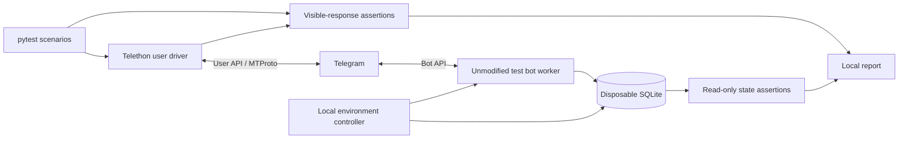

# Real-user Telegram end-to-end testing — proposed design

Design date: 27 September 2026. This document records the architecture proposal. A first local-subprocess implementation now exists; see [the operating guide](telegram-e2e.md) for supported commands and limits. Live acceptance remains separate from offline verification. Execution status belongs in Beads (design task `eg-o7h`, implementation `eg-3ac`).

## Project evidence and goals

The application uses Python 3.13, aiogram, asyncio, SQLite, Alembic and a single worker with durable receiver, processor, sender and cleanup loops. Telegram polling accepts messages, edited messages and callbacks. Tests already use pytest/pytest-asyncio, synthetic updates, temporary migrated databases and `FakeGateway`. They cover transport failures and food approval invariants without Telegram access.

Relevant sources: `pyproject.toml`, `src/nutrition_bot/telegram/gateway.py`, `src/nutrition_bot/runtime/worker.py`, `src/nutrition_bot/config.py`, `tests/helpers.py`, `tests/test_transport.py`, `tests/test_telegram_drafts.py`, and `docs/foundation-operations.md`. Some foundation prose predates the current feature set; source and tests are the evidence for current local capabilities. This review did not inspect the live deployment.

The missing layer must authenticate as a real Telegram user, send messages/replies/edits, press actual delivered buttons, inspect visible results and repeat scenarios against a clean application state. It should expose failures clearly and fit the existing local development workflow.

The single-profile database is not tenant-isolated. A second test user against the production database would not create an independent ledger. A small runtime host is capacity-constrained; repeated regression runs belong on a development machine or dedicated runner.

## Approaches

| Approach | Strengths | Trade-offs | Fit |
| --- | --- | --- | --- |
| Python runner with Telethon user authentication over MTProto | Real Telegram transport; structured messages, edits and buttons; fits existing async pytest stack; no browser needed | Requires API application credentials and user login/session; rate limits and network uncertainty; does not verify screen rendering | Best initial functional E2E layer |
| Playwright driving Telegram Web as a logged-in user | Exercises visible chat, buttons, formatting and uploads; screenshots and traces explain UI failures | Telegram Web selectors and loading behavior can change; browser/session maintenance; slower and more fragile assertions | Suitable if visible UI behavior is the primary requirement |
| Hybrid: Telethon regression plus a small Playwright acceptance suite | Functional breadth plus visual checks; browser tests concentrate on a few important journeys | Two drivers, two authentication stores and additional maintenance; same-account runs need serialization | Good later extension once visual regressions justify it |

Telethon exposes user login, message operations and button interaction in its [stable client documentation](https://docs.telethon.dev/en/stable/modules/client.html) and [message/button documentation](https://docs.telethon.dev/en/stable/modules/custom.html). Playwright supports [authentication reuse](https://playwright.dev/python/docs/auth) and [execution traces](https://playwright.dev/python/docs/trace-viewer). The maintenance and fit assessments above are engineering judgments for this repository.

**Recommendation:** build approach one as a development-only Python application, using pytest as the scenario engine and a small command-line entry point for setup, execution and reports. Preserve a narrow driver interface so approach three remains possible. A dashboard, scheduler service, agent framework and LLM judge add little value to the first version.

Injecting updates through `FakeGateway` remains valuable, but cannot prove the real-user Telegram path. The existing aiogram Bot API client implements the bot side; the test actor needs user authentication.

## Architecture

The controller starts a separate bot instance from the working source, runs real migrations, seeds deterministic fixture data and waits for local health. An optional Compose mode uses the packaged image and an isolated project/volume for release checks. It uses the existing worker and Telegram gateway without replacing the network path.

All actions under test go through Telegram. Setup may seed reference foods and dated history locally; assertions may read the isolated database. A database write must never substitute for the user action being tested. Plain Telegram-only assertions remain useful for remote smoke tests, but cannot prove absence of hidden duplicate mutations.

Suggested modules, to be added during implementation:

- `tools/telegram_e2e/cli.py`: login, configuration validation, suite selection and run summary.
- `tools/telegram_e2e/driver.py`: `send`, `reply`, `edit`, `click`, `wait_for` and future media operations.
- `tools/telegram_e2e/environment.py`: migrate, seed, start, health, stop and safe reset.
- `tools/telegram_e2e/assertions.py`: response matching and independent fixture expectations.
- `tools/telegram_e2e/reporting.py`: redacted event timeline, JSON/JUnit and a simple local HTML report.
- `tests/e2e/`: typed Python scenarios and pytest fixtures.

Use a separate optional dependency group for Telethon and the E2E tooling; lock a stable release after checking Python 3.13 compatibility in a small spike. Continue pytest-asyncio, Ruff and mypy. Default pytest collection must exclude live scenarios unless explicitly enabled; missing live credentials on an explicitly requested run produce a setup failure, not a misleading green suite.

## Identity, isolation and lifecycle

Use a dedicated test bot token on normal Telegram and preferably a dedicated real user account controlled by the owner. The test bot allowlists that user's numeric ID and private chat ID. This does not require making the application multi-user. A personal user account is technically possible but provides poorer separation.

Telegram API application registration supplies `api_id` and `api_hash`; an initial interactive user login handles the code and any two-step password. Later runs reuse the session. See [Telegram application setup](https://core.telegram.org/api/obtaining_api_id) and [Telethon sign-in](https://docs.telethon.dev/en/stable/basic/signing-in.html). Session revocation requires manual reauthentication; the runner should fail clearly rather than repeatedly attempting login.

Keep credentials, session files, test-account identifiers and run artifacts under ignored `private/telegram-e2e/` with restricted permissions. A Telethon session provides account access and must be treated as a credential ([session documentation](https://docs.telethon.dev/en/stable/concepts/sessions.html)). Extend secret scanning and packaging checks to session files and browser profiles if introduced. Avoid collecting unrelated account updates or chat history.

Require an explicit E2E configuration file; do not inherit the production `.env` by default. Before any send/reset, verify the authenticated user, target bot identity, allowlist and disposable storage marker. Reject an unregistered target or storage outside the E2E root. Hold one lock per account/test-bot pair and one environment lock. Never start a second Bot API poller for the same token.

Each independent scenario begins with a fresh migrated database and known synthetic reference fixtures, with paid providers disabled. Multi-step flows and restart tests retain their database until that scenario ends. Teardown stops the worker before removing disposable state and runs even after failure.

Telegram chat history and queued updates survive a database reset. At a scenario boundary, with the worker stopped and exclusive test-token ownership established, drain and acknowledge old updates for this test bot and seed the fresh cursor beyond them. The controller's temporary polling role ends before the worker starts. Subscribe the user driver and record a message watermark before new actions. Never apply this procedure to the production token; do not use chat deletion as database cleanup. Late arrivals must be detected as unexpected traffic, rather than accepted as scenario responses.

## Scenario execution and assertions

Start with typed Python scenarios instead of a new YAML language. Each step declares its action, expected message or callback result, deadline and relevant state invariant. Capture outgoing message IDs and keep handles to delivered bot messages.

Register event collection before sending. Filter events by bot identity, private dialog, message IDs, new/edit event type and step watermark. Use reply relationships when available; otherwise use sequential actions and content predicates. The current gateway does not attach every response to a triggering message, so correlation cannot rely solely on reply IDs. Support multiple messages per step and fail on ambiguity instead of taking the first message in the chat.

Click a uniquely matching button on the captured message; never manufacture its callback token. Record callback acknowledgements separately from new chat replies. For stale-button scenarios, deliberately retain the earlier message handle. For edited-message scenarios, await a new edit event/version on the same message ID rather than requiring a larger ID.

Assertions check quantities, units, provenance, draft state, button availability and totals using explicit fixture expectations. Do not compute the expected answer using the same application calculation being tested. Keep unknown nutrients unknown. Use targeted text matches or normalized snapshots where wording matters; strip only declared volatile fields such as timestamps and generated IDs.

Use bounded event waits rather than fixed sleeps. Run scenarios serially per account/bot. Apply conservative pacing, honor server-requested flood waits and stop with an infrastructure result when the wait exceeds the run budget. Do not resend a mutating step just because its reply timed out: inspect captured messages and isolated state first. Any whole-scenario rerun starts clean, preserves the failed attempt and is identified in the report. Telethon documents [request retries and flood handling](https://docs.telethon.dev/en/stable/modules/client.html).

The worker guarantees deduplicated application actions, not exactly-once network replies. In restart/ambiguous-delivery tests, a duplicate receipt may be permissible while a duplicate meal is always a failure. Unexpected duplicates during normal scenarios should still be reported.

## Initial coverage

| Scenario | Required evidence |
| --- | --- |
| `/start`, `/status`, Refresh status | Delivered replies, real button acknowledgement, preserved singleton profile |
| Exact measured meal, then `/today` | Expected item and totals; one persisted entry |
| Rough quantity | Visible draft with estimate approval; excluded from totals before approval |
| Revise rough quantity and press old button | Old revision rejected; only new displayed revision can be saved |
| Repeat approval | One ledger mutation despite another real callback |
| Reply correction and edit original Telegram message | Correct linked entry revised; no extra meal |
| Delete and undo | Correct visible result and restored/deleted state |
| Unknown nutrient fixture | Unknown remains visibly distinct from zero |
| Restart isolated worker | Data retained, health restored, subsequent Telegram interaction works |

The rough-quantity case can follow the existing offline fixture: send `about 150g rice`, inspect the draft, confirm `/today` excludes it, reply with `item 1: about 120g`, press the old approval and verify no save, then press the new approval and verify one 120 g estimated entry with the matching revision. This automates explicit approval only for that synthetic scenario's displayed draft.

Expand to implemented goals, weights, training, recovery and supplements after the food path is reliable. Media, AI, reminders and exports get live scenarios when their actual capability is present; an unimplemented feature is reported as unsupported, never passed. Scheduled-time and injected-crash edge cases remain primarily offline tests. A real-user driver cannot deterministically reproduce every transport failure or forge duplicate update IDs.

Unauthorized-user live coverage needs an additional explicitly configured account; retain existing offline authorization coverage meanwhile. Avoid claiming one authorized account proves all access-control cases.

## Reports and repeated development use

Proposed commands: `telegram-e2e login`, `telegram-e2e doctor`, `telegram-e2e run smoke`, and `telegram-e2e run regression`. These are interface proposals, not commands currently available in the repository.

Every report includes scenario/step results, expected versus observed values, elapsed time, source/build fingerprint, fixture version, environment mode and redacted message/callback timeline. Distinguish assertion failure, setup failure, infrastructure timeout/rate limit and unsupported scenario. Both assertion and infrastructure failures produce unsuccessful run exit codes.

Keep raw identifiers and synthetic conversation artifacts local with a short configurable retention period, initially seven days. Shared summaries use aliases instead of real Telegram IDs; secrets never enter artifacts. Retain only relevant diagnostic state, not entire personal databases or account histories.

Run a small live smoke suite on demand after relevant changes; run selected feature regressions before deployment. Keep the fast offline suite as the frequent feedback loop. A future trusted CI runner can execute live tests serially with protected credentials; untrusted PR jobs continue offline only. CI publication and recurring scheduling are separate implementation decisions, not activated by this design.

## Implementation outline and completion criteria

1. Prove user login, send, edit and actual inline-button acknowledgement against a disposable test bot; verify package compatibility and rate-limit behavior. Account/bootstrap inputs are needed only to execute this stage, not to finish this design.
2. Build configuration validation, target guards, session/environment locks, disposable migrations/seeding, backlog isolation and reliable teardown.
3. Add the event collector, message handles, assertions, deadlines and result classification; implement the food-ledger scenarios first.
4. Add local reports and developer commands. Test the runner itself offline for stale events, response races, timeout ambiguity, redaction and refusal of unsafe targets. Run Ruff, mypy and relevant existing tests for application changes; use container smoke when adding Compose execution.
5. Demonstrate repeated clean smoke runs and a restart scenario. Deliberately introduce a wrong expected quantity and a disconnected transport to verify that the report distinguishes product assertion failures from infrastructure errors. Check the runner leaves no poller or production-state changes behind.
6. Consider a few Playwright visual checks only if Telegram rendering failures remain a material gap. Share scenario intent and reporting, but retain driver-specific implementations.

Acceptance requires real Telegram evidence for each initial scenario, reliable repetition with clean state, no leakage of session credentials into outputs, and explicit distinction between transport success, user-visible correctness and persisted-state correctness. Offline checks alone do not satisfy live E2E acceptance.
